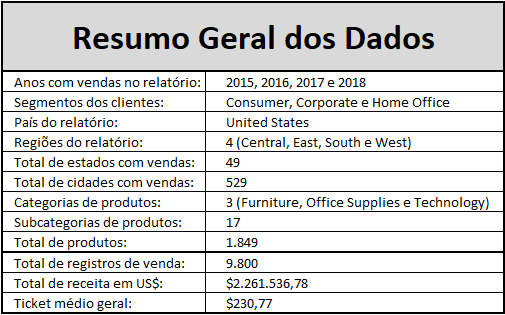

# Análise de dados: Vendas de um Hipermercado

## Apresentação do projeto
Os dados de vendas de uma empresa têm o potencial de gerar insights valiosos para a equipe comercial. Para concretizar esse potencial, no entanto, é necessária uma **análise criteriosa que transforme dados brutos em informações acionáveis**. A <u>Análise Exploratória de Dados (EDA)</u> é uma abordagem excepcional para extrair esse valor. Este projeto, desenvolvido no Excel, tem como objetivo aplicar a EDA a um conjunto de dados de vendas para **identificar tendências, oportunidades e áreas de melhoria**.

## Escolha do Dataset
O *dataset* utilizado neste projeto está disponível no **Kaggle** neste [link](https://www.kaggle.com/datasets/rohitsahoo/sales-forecasting). A seleção foi baseada em uma busca por *datasets* relacionados a "*sales*" (vendas) na plataforma.

## Objetivo Geral da Análise
Aplicar a EDA para gerar insights estratégicos para a equipe comercial, identificando padrões de vendas que possam ajudar na tomada de decisão.

## Perguntas de Negócio
Este projeto buscará responder às seguintes perguntas de negócio:

- Qual região, estado e cidade apresentam o maior volume de vendas?
- Quais são as categorias e subcategorias de produtos com melhor desempenho em vendas?
- Qual produto gera a maior receita?
- Qual segmento de cliente possui o maior volume de compras?
- Quem são os principais clientes em termos de valor gerado e quantidade de vendas?
- Existe sazonalidade nas vendas da empresa? Se sim, quais são os meses de pico em quantidade de vendas e receita?

## Processo de ETL
O processo de Extração, Transformação e Carregamento foi detalhado [aqui](./docs/ETL_details.md).

## Análise Inicial dos Dados
Para familiarização com o *dataset*, realizamos uma análise rápida de cada variável. Uma forma prática foi utilizar o filtro da planilha, que oferece uma visão geral dos valores em cada coluna.

Também realizamos uma análise univariada da coluna *Sales*, que consideramos fundamental para obter informações relevantes. Os resultados foram os seguintes:

Veja como esse processo foi implementado [aqui](./docs/Dataset_overview.md).

