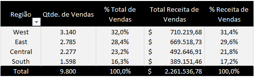
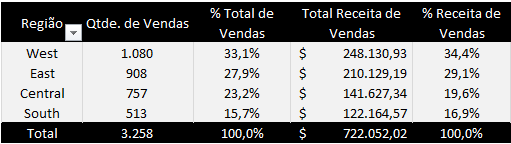
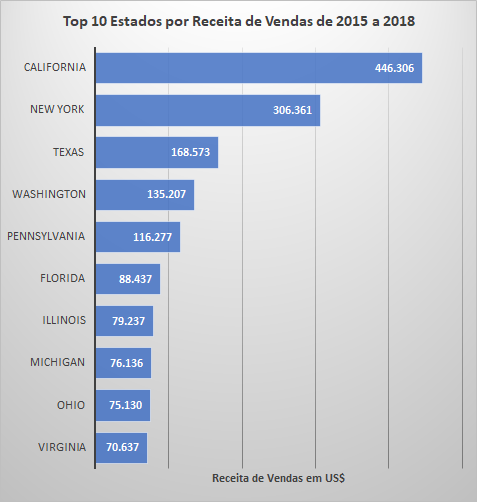
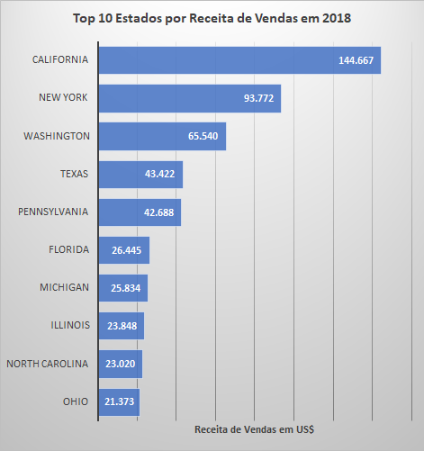
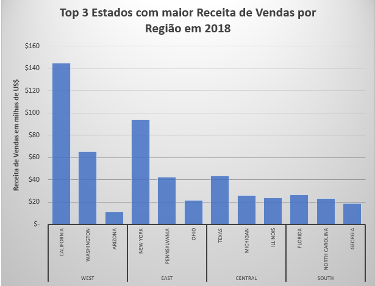
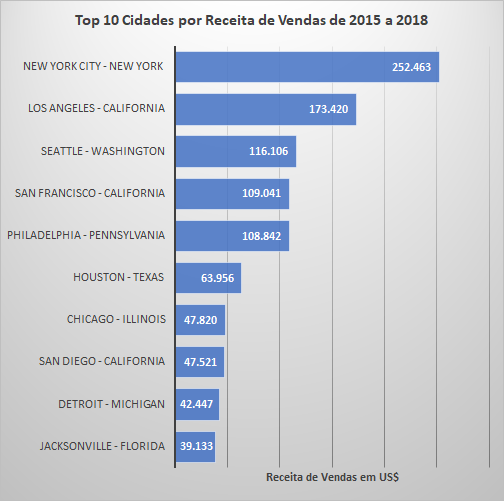
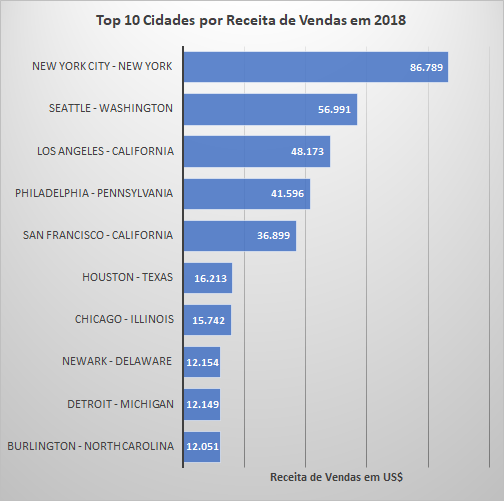
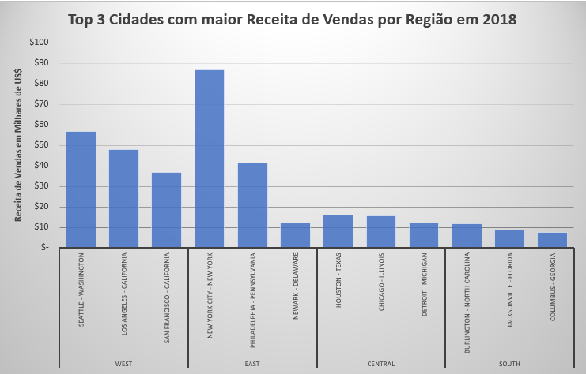

# Análise de dados: Vendas de um Hipermercado

## Apresentação do projeto
Os dados de vendas de uma empresa têm o potencial de gerar insights valiosos para a equipe comercial. Para concretizar esse potencial, no entanto, é necessária uma **análise criteriosa que transforme dados brutos em informações acionáveis**. A <u>Análise Exploratória de Dados (EDA)</u> é uma abordagem excepcional para extrair esse valor. Este projeto, desenvolvido no Excel, tem como objetivo aplicar a EDA a um conjunto de dados de vendas para **identificar tendências, oportunidades e áreas de melhoria**.

## Escolha do Dataset
O *dataset* utilizado neste projeto está disponível no **Kaggle** neste [link](https://www.kaggle.com/datasets/rohitsahoo/sales-forecasting). A seleção foi baseada em uma busca por *datasets* relacionados a "*sales*" (vendas) na plataforma.

## Objetivo Geral da Análise
Aplicar a EDA para gerar insights estratégicos para a equipe comercial, identificando padrões de vendas que possam ajudar na tomada de decisão.

## Perguntas de Negócio
Este projeto buscará responder às seguintes perguntas de negócio:

`PN 1` Qual região, estado e cidade apresentam o maior volume de vendas?

`PN 2` Quais são as categorias e subcategorias de produtos com melhor desempenho em vendas?

`PN 3` Qual produto gera a maior receita?

`PN 4` Qual segmento de cliente possui o maior volume de compras?

`PN 5` Quem são os principais clientes em termos de valor gerado e quantidade de vendas?

`PN 6` Existe sazonalidade nas vendas da empresa? Se sim, quais são os meses de pico em quantidade de vendas e receita?

## Processo de ETL
O processo de Extração, Transformação e Carregamento foi detalhado [aqui](./docs/ETL_details.md).

## Análise Inicial dos Dados
Para familiarização com o *dataset*, realizamos uma análise rápida de cada variável. Uma forma prática foi utilizar o filtro da planilha, que oferece uma visão geral dos valores em cada coluna.

Também realizamos uma análise univariada da coluna *Sales*, que consideramos fundamental para obter informações relevantes. Os resultados foram os seguintes:

Veja como esse processo foi implementado [aqui](./docs/Dataset_overview.md).

## Análise dos Dados

Através do EDA, foi possível chegar a algumas descobertas do dataset. Essas descobertas podem ser valiosas para a equipe comercial da empresa. As respostas às Perguntas de Negócio citadas acima são:

### PN 1:

Para realizar o mapeamento da localização das vendas da companhia focamos nas variáveis *Region*, *State* e *City* (Região, Estado e Cidade respectivamente). Assim tivemos os seguintes resultados:

#### Vendas por Região
A região com maior receita de vendas ao longo do tempo é a **West** (31,4%), seguida pela **East** (29,6%). A margem aumenta quando consideramos apenas o último ano (2018), em que **West** tem 34,4% da receita de vendas da companhia, enquanto **East** continua em segundo lugar, com 29,1%.

##### Análise de Vendas por Região de 2015 a 2018

##### Análise de Vendas por Região em 2018

#### Vendas por Estado
Os estados com maior receita de vendas, considerando os registros de 2015 a 2018, são:
1.	**California**, com 19,7%.
2.	**New York**, com 13,5%.
3.	**Texas**, com 7,5%.

Se considerarmos apenas o último ano (2018), o ranking modifica-se apenas no terceiro estado do ranking:
1.	**California**, com 20,0%.
2.	**New York**, com 13,0%.
3.	**Washington**, com 9,1%.

Os estados mais destacados em sua região quanto à receita de vendas em 2018 foram:

- **California** e **Washington** na região **West**.
- **New York** e **Pennsylvania** na região **East**.
- **Texas** na região **Central**.
- **Florida** e **North Carolina** na região **South**.

#### Vendas por Cidade
As cidades com maior receita de vendas a nível nacional de 2015 a 2018 foram:
1.	**New York City**
2.	**Los Angeles**
3.	**Seattle**
4.	**San Francisco**
5.	**Philadelphia**
6.	**Houston**

Quando analisado apenas o ano de 2018, o ranking continua com as mesmas cidades, porém em ordem diferente:
1.	**New York City**
2.	**Seattle**
3.	**Los Angeles**
4.	**Philadelphia**
5.	**San Francisco**
6.	**Houston**

Também em 2018, as cidades destacadas de cada região foram:
- **Seattle**, **Los Angeles** e **San Francisco** na região **West**.
- **New York** e **Philadelphia** na região **East**.
- **Houston**, **Chicago** e **Detroit** na região **Central**.
- **Burlington**, **Jacksonville** e **Columbus** na região **South**.

