# Análise de dados: Vendas de um Hipermercado

## Apresentação do projeto
Os dados de vendas de uma empresa têm o potencial de gerar insights valiosos para a equipe comercial. Para concretizar esse potencial, no entanto, é necessária uma **análise criteriosa que transforme dados brutos em informações acionáveis**. A <u>Análise Exploratória de Dados (EDA)</u> é uma abordagem excepcional para extrair esse valor. Este projeto, desenvolvido no Excel, tem como objetivo aplicar a EDA a um conjunto de dados de vendas para **identificar tendências, oportunidades e áreas de melhoria**.

## Escolha do Dataset
O *dataset* utilizado neste projeto está disponível no **Kaggle** neste [link](https://www.kaggle.com/datasets/rohitsahoo/sales-forecasting). A seleção foi baseada em uma busca por *datasets* relacionados a "*sales*" (vendas) na plataforma.

## Objetivo Geral da Análise
Aplicar a EDA para gerar insights estratégicos para a equipe comercial, identificando padrões de vendas que possam ajudar na tomada de decisão.

## Perguntas de Negócio
Este projeto buscará responder às seguintes perguntas de negócio:

`PN 1` Qual região, estado e cidade apresentam o maior volume de vendas?

`PN 2` Quais são as categorias e subcategorias de produtos com melhor desempenho em vendas?

`PN 3` Qual produto gera a maior receita?

`PN 4` Qual segmento de cliente possui o maior volume de compras?

`PN 5` Quem são os principais clientes em termos de valor gerado e quantidade de vendas?

`PN 6` Existe sazonalidade nas vendas da empresa? Se sim, quais são os meses de pico em quantidade de vendas e receita?

## Processo de ETL
O processo de Extração, Transformação e Carregamento foi detalhado [aqui](./docs/ETL_details.md).

## Análise Inicial dos Dados
Para familiarização com o *dataset*, realizamos uma análise rápida de cada variável. Uma forma prática foi utilizar o filtro da planilha, que oferece uma visão geral dos valores em cada coluna.

Também realizamos uma análise univariada da coluna *Sales*, que consideramos fundamental para obter informações relevantes. Os resultados foram os seguintes:

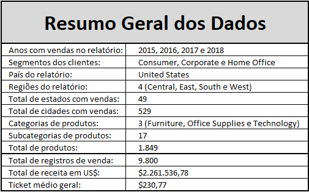

Veja como esse processo foi implementado [aqui](./docs/Dataset_overview.md).

## Análise dos Dados

Através do EDA, foi possível chegar a algumas descobertas do dataset. Essas descobertas podem ser valiosas para a equipe comercial da empresa. As respostas às Perguntas de Negócio citadas acima são:

### [PN 1](./docs/PN1.md):
Para realizar o mapeamento da localização das vendas da companhia focamos nas variáveis *Region*, *State* e *City* (Região, Estado e Cidade respectivamente). Assim tivemos os seguintes resultados:

#### Vendas por Região
A região com maior receita de vendas ao longo do tempo é a **West** (31,4%), seguida pela **East** (29,6%). A margem aumenta quando consideramos apenas o último ano (2018), em que **West** tem 34,4% da receita de vendas da companhia, enquanto **East** continua em segundo lugar, com 29,1%.

##### Análise de Vendas por Região de 2015 a 2018
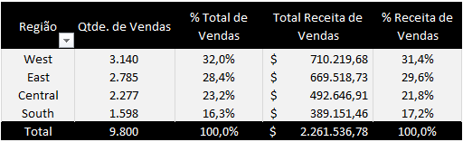

##### Análise de Vendas por Região em 2018
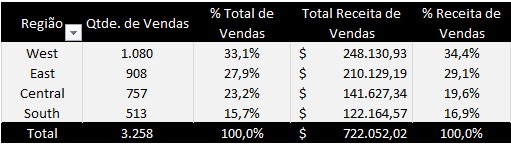

#### Vendas por Estado
Os estados com maior receita de vendas, considerando os registros de 2015 a 2018, são:
1.	**California**, com 19,7%.
2.	**New York**, com 13,5%.
3.	**Texas**, com 7,5%.

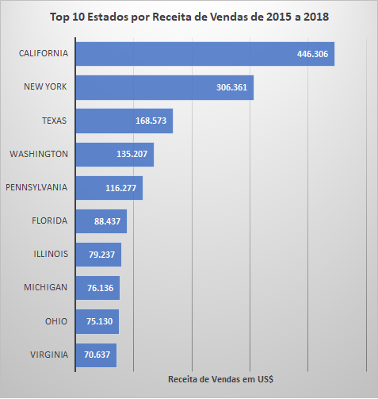

Se considerarmos apenas o último ano (2018), o ranking modifica-se apenas no terceiro estado do ranking:
1.	**California**, com 20,0%.
2.	**New York**, com 13,0%.
3.	**Washington**, com 9,1%.

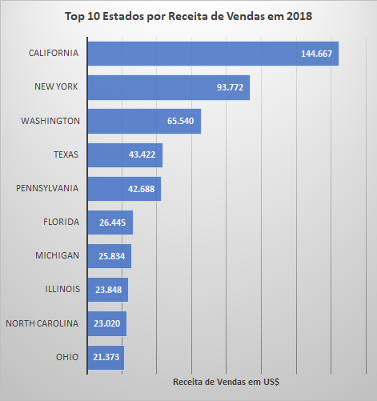

Os estados mais destacados em sua região quanto à receita de vendas em 2018 foram:

- **California** e **Washington** na região **West**.
- **New York** e **Pennsylvania** na região **East**.
- **Texas** na região **Central**.
- **Florida** e **North Carolina** na região **South**.

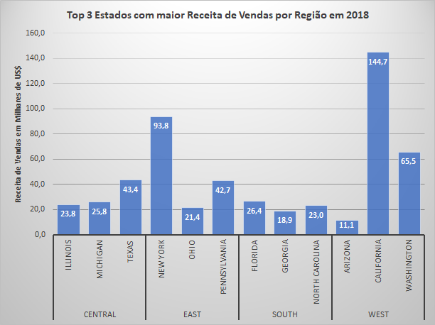

#### Vendas por Cidade
As cidades com maior receita de vendas a nível nacional de 2015 a 2018 foram:
1.	**New York City**
2.	**Los Angeles**
3.	**Seattle**
4.	**San Francisco**
5.	**Philadelphia**
6.	**Houston**

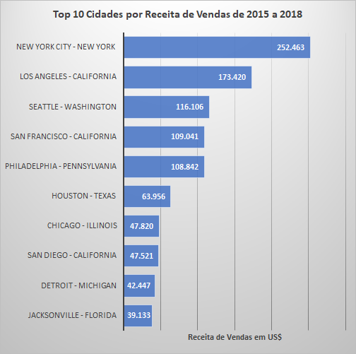

Quando analisado apenas o ano de 2018, o ranking continua com as mesmas cidades, porém em ordem diferente:
1.	**New York City**
2.	**Seattle**
3.	**Los Angeles**
4.	**Philadelphia**
5.	**San Francisco**
6.	**Houston**

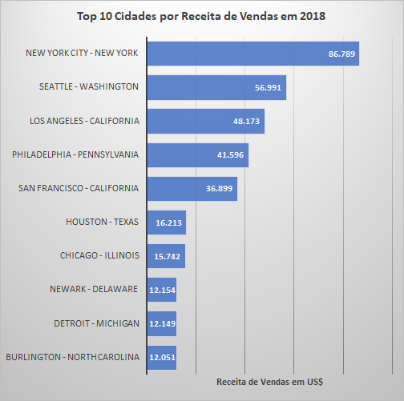

Também em 2018, as cidades destacadas de cada região foram:
- **Seattle**, **Los Angeles** e **San Francisco** na região **West**.
- **New York** e **Philadelphia** na região **East**.
- **Houston**, **Chicago** e **Detroit** na região **Central**.
- **Burlington**, **Jacksonville** e **Columbus** na região **South**.

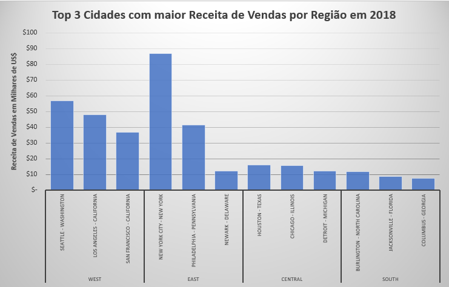

Confira a análise mais detalhada [aqui](./docs/PN1.md).

### [PN 2](./docs/PN2.md):
Para poder identificar a **Categoria** e **Subcategoria** com a melhor performance em geração de receita de vendas analisamos as variáveis *Category* e *Sub-Category*. Assim encontramos a seguinte informação:

#### Vendas por Categoria
A categoria que mais se destaca em receita de vendas é **Technology**, que, entre 2015 e 2018, gerou 36,6% do valor total. No último ano (2018), esse percentual aumentou para 37,3%. Essa categoria também possui o maior *Ticket Médio* entre as três: US$ 440,87 por produto.

##### Receita de Vendas por Categoria (2015 a 2018)
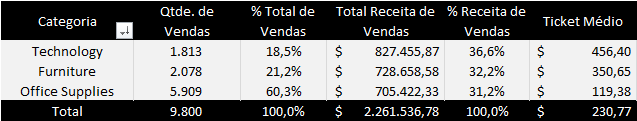

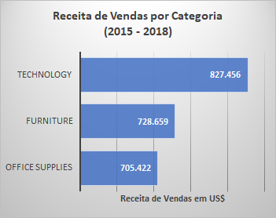

##### Receita de Vendas por Categoria em 2018
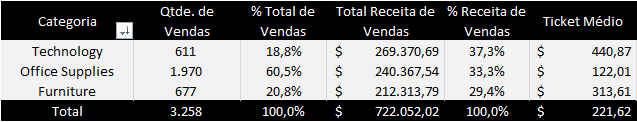

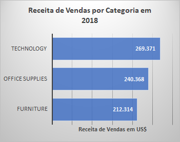

#### Vendas por Subcategoria
Duas subcategorias se destacam em receita de vendas no período de 2015 a 2018: **Phones** (14,5%) e **Chairs** (14,3%). Ambas mantêm a liderança ao analisarmos apenas 2018, com **Phones** representando 14,5% e **Chairs**, 12,9%.

##### Receita de Vendas por Subcategoria de 2015 a 2018
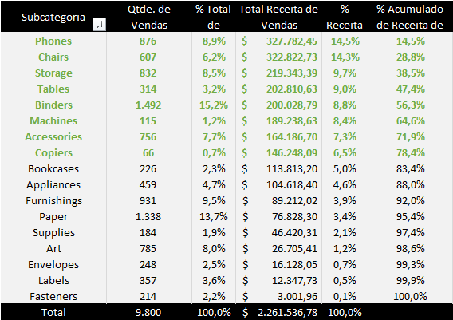

##### Receita de Vendas por Subcategoria em 2018
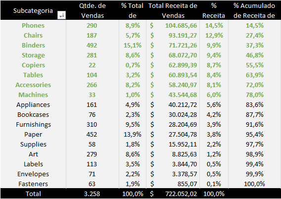

#### Vendas das Subcategorias por Categoria
Para orientar as equipes responsáveis por cada categoria, analisamos a receita de 2018 por subcategoria. As subcategorias com a maior receita de vendas para cada categoria são:

**Technology:** *Phones*, *Copiers*, *Accessories* e *Machines*

**Office Supplies:** *Binders*, *Storage* e *Appliances*

**Furniture:** *Chairs* e *Tables*

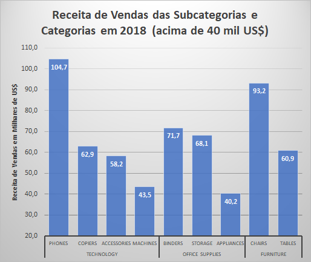

### Vendas das Subcategorias por Região
Com o intuito de guiar os líderes regionais, analisamos a receita de 2018 por subcategoria em cada região. As subcategorias com a maior receita de vendas para cada região são:

**EAST:** *Phones*, *Chairs* e *Copiers*

**WEST:** *Copiers*, *Binders* e *Accessories*

**CENTRAL:** *Phones*, *Chairs* e *Binders*

**SOUTH:** *Phones*, *Chairs* e *Tables*

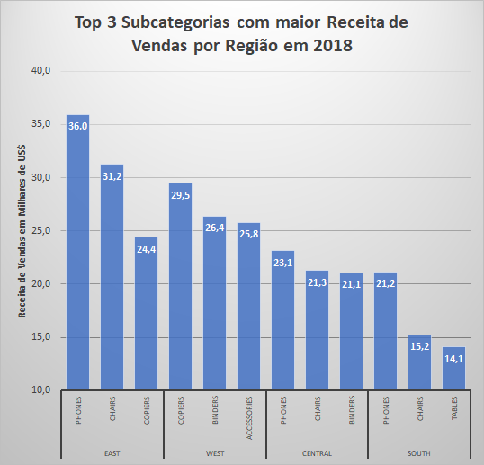

Confira a análise mais detalhada [aqui](./docs/PN2.md).

### [PN 3](./docs/PN3.md):
Para responder a esta pergunta, analisamos a variável Product_Name junto com a variável de valor da venda, para assim identificarmos os produtos mais vendidos na companhia.

#### Vendas por Produto
##### Top 20 Produtos com maior Receita de Vendas (a nível nacional) de 2015 a 2018

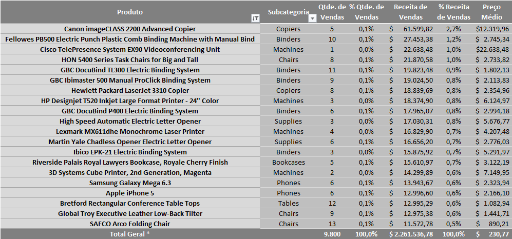

Os produtos com maior receita de vendas no período de 2015 a 2018 foram:

1. *Canon imageCLASS 2200 Advanced Copier*, que pertence à categoria **Technology**.

2. *Fellowes PB500 Electric Punch Plastic Comb Binding Machine with Manual Bind*, da categoria **Office Supplies**.

3. *Cisco TelePresence System EX90 Videoconferencing Unit*, que pertence à categoria **Technology**.

##### Top 20 Produtos com maior Receita de Vendas (a nível nacional) em 2018
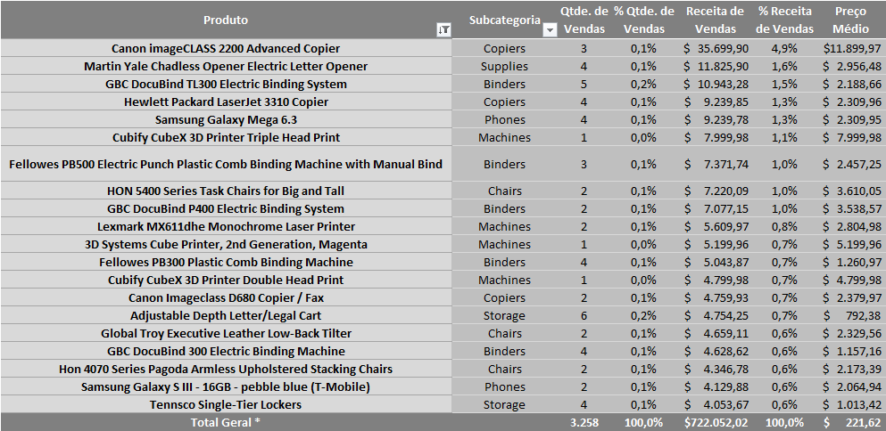

Em 2018, os produtos com maior receita de vendas foram:

1. *Canon imageCLASS 2200 Advanced Copier*, que pertence à categoria **Technology**.

2. *Martin Yale Chadless Opener Electric Letter Opener*, da categoria **Office Supplies**.

3. *GBC DocuBind TL300 Electric Binding System*, também da categoria **Office Supplies**.

Como vemos nos períodos analisados, destacam-se produtos da categoria **Technology**, seguidos pela categoria **Office Supplies**.

##### Top 10 Produtos com maior Quantidade de Vendas (a nível nacional) de 2015 a 2018
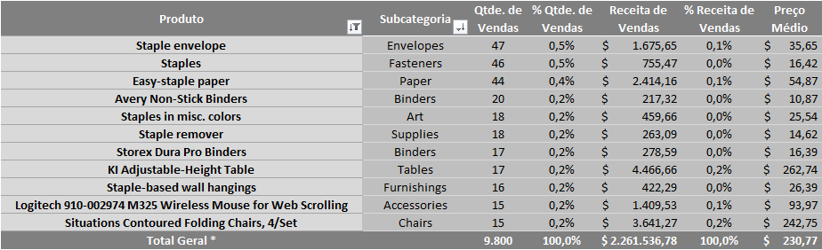

Quando consideramos a quantidade de vendas realizadas, de 2015 a 2018 destacam-se os seguintes produtos:

1. Staple envelope (47 vendas).

2. Staples (46 vendas).

3. Easy-staple paper (44 vendas).

##### Top 10 Produtos com maior Quantidade de Vendas (a nível nacional) em 2018
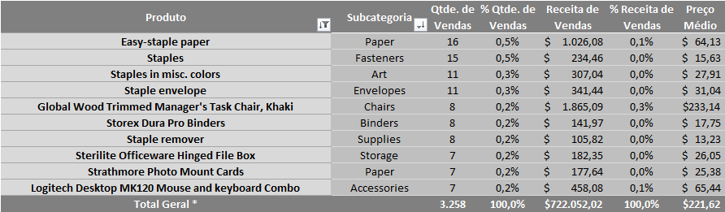

Em 2018, repetem-se alguns produtos no Top 3 de mais vendas:

1. Easy-staple paper (16 vendas).

2. Staples (15 vendas).

3. Staples in misc. Colors e Staple envelope (11 vendas).

#### Vendas de Produtos por Região
##### Top 3 Produtos com maior Receita de Vendas por Região em 2018
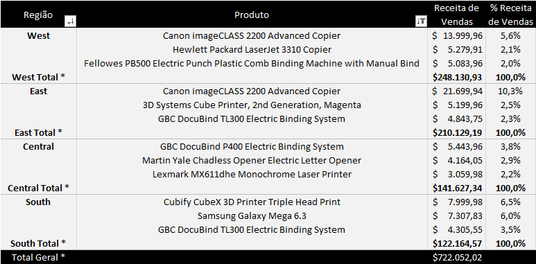

Foram identificados os produtos com maior receita de vendas em cada região no ano de 2018. O resultado foi o seguinte:

- O produto com maior receita de vendas em **EAST** foi o *Canon imageCLASS 2200 Advanced Copier*, da categoria **Technology**.

- O produto com maior receita de vendas em **WEST** também foi o *Canon imageCLASS 2200 Advanced Copier*, da categoria **Technology**.

- O produto com maior receita de vendas em **SOUTH** foi o *Cubify CubeX 3D Printer Triple Head Print*, da categoria **Technology**.

- O produto com maior receita de vendas na região **CENTRAL** foi o *GBC DocuBind P400 Electric Binding System*, da categoria **Office Supplies**.

Confira a análise mais detalhada [aqui](./docs/PN3.md).

### [PN 4](./docs/PN4.md):

Realizamos análises com o objetivo de identificar o segmento de clientes com maior geração de vendas para a companhia. Assim como nas análises anteriores, também buscamos identificar os segmentos mais rentáveis em cada ano, categoria de produto e região de venda. Os resultados são os seguintes:

#### Análise de Vendas por Segmento de Cliente
##### Vendas por Segmento de Cliente de 2015 a 2018
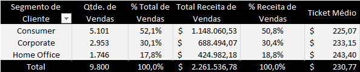

Ao observar o comportamento das vendas por segmento de cliente de 2015 a 2018, obtemos que:

- O segmento com maior volume de vendas é **Consumer**, com **52,1%** das vendas, que geraram **50,8%** da receita total da companhia no período.

##### Vendas por Segmento de Cliente em 2018
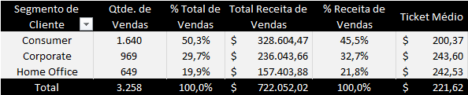

Quando analisamos as vendas de 2018, o resultado foi:

- **Consumer** continua sendo o segmento com maior volume de vendas, com **50,3%** das vendas da companhia, que equivalem a **45,5%** da receita total da empresa.

##### Receita de Vendas por Segmento de Cliente de 2015 a 2018
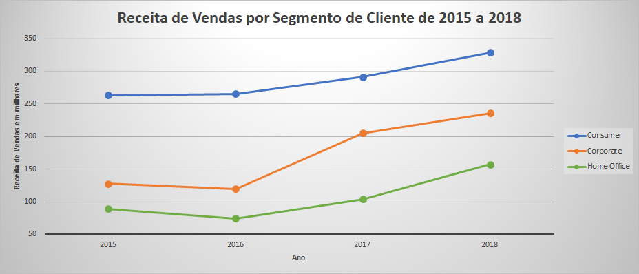

Em relação à tendência das vendas ano a ano, concluímos que os três segmentos tiveram estagnação (no caso de **Consumer**) ou redução (no caso de **Corporate** e **Home Office**) das vendas em **2016**. Em 2017 e 2018, todos os segmentos apresentaram crescimento na receita gerada.

##### Vendas por Segmento de Cliente por Categoria em 2018

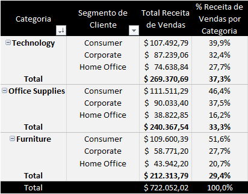

- **Technology**: **Consumer** é o segmento com maior geração de receita de vendas no período. *Os segmentos dentro desta categoria são equilibrados em termos de geração de receita.*

- **Office Supplies**: Os segmentos com maior receita gerada foram **Consumer** e **Corporate**.

- **Furniture**: Por uma ampla margem, o segmento com maior receita gerada foi **Consumer**.

##### Vendas por Segmento de Cliente por Região em 2018

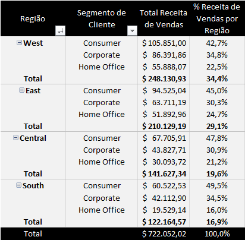

O segmento de clientes com maior receita de vendas gerada em cada região foi:

- **WEST**: **Consumer** com **42,7%** da receita total gerada no período.
- **EAST**: **Consumer** com **45,0%** da receita total gerada no período.
- **CENTRAL**: **Consumer** com **47,8%** da receita total gerada no período.
- **SOUTH**: **Consumer** com **49,5%** da receita total gerada no período.

Confira a análise mais detalhada [aqui](./docs/PN4.md).

### [PN 5](./docs/PN5.md):

Para gerar insights estratégicos à equipe comercial, foram analisadas as variáveis relacionadas aos clientes (ID do cliente e Nome do Cliente) e seus respectivos valores de venda, resultando nas seguintes conclusões:

### Análise de Vendas por Clientes

#### Análise por quantidade de compras
Foram analisados os clientes pela quantidade de compras realizadas. Os resultados foram os seguintes:

##### Clientes com maior quantidade de Compras Realizadas de 2015 a 2018
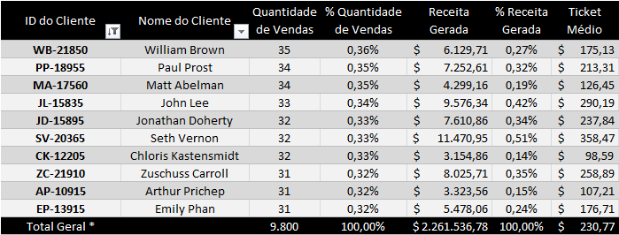

Os clientes com maior volume de compras no período são:
1. **William Brown** (35 compras)
2. **Paul Prost** (34 compras)
2. **Matt Abelman** (34 compras)
3. **John Lee** (33 compras)

##### Clientes com maior quantidade de Compras Realizadas em 2018
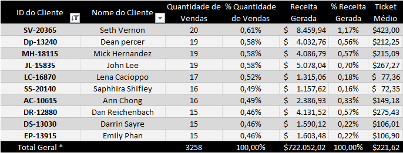

Os clientes com maior volume de compras em 2018 foram:
1. **Seth Vernon** (20 compras)
2. **Dean Percer** (19 compras)
2. **Mick Hernandez** (19 compras)
2. **John Lee** (19 compras)
3. **Lena Cacioppo** (17 compras)

#### Análise por receita de vendas gerada
Foram analisados os clientes pelo valor da receita de vendas gerada. Os resultados foram os seguintes:

##### Clientes com maior Receita de Vendas Gerada de 2015 a 2018
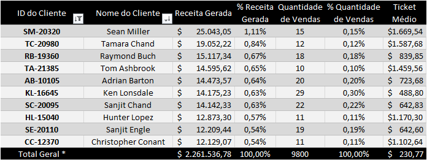

Os clientes com maior receita de vendas no período foram:
1. **Sean Miller** com US$ 25.043,05
2. **Tamara Chand** com US$ 19.052,22
3. **Raymond Buch** com US$ 15.117,34

##### Clientes com maior Receita de Vendas Gerada em 2018
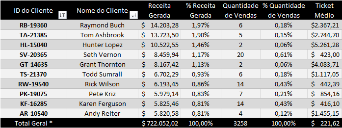

Os clientes com maior receita de vendas em 2018 foram:
1. **Raymond Buch** com US$ 14.203,28
2. **Tom Ashbrook** com US$ 13.723,50
3. **Hunter Lopez** com US$ 10.522,55

### Análise de Vendas por Clientes por Categoria em 2018
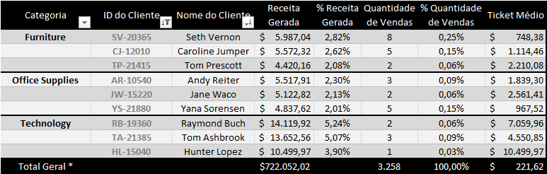

Para orientar os responsáveis de cada categoria, listamos os clientes com maior receita de vendas em 2018:

- **Furniture**: **Seth Vernon** com US$ 5.987,04
- **Office Supplies**: **Andy Reiter** com US$ 5.517,91
- **Technology**: **Raymond Buch** com US$ 14.119,92

### Análise de Vendas por Clientes por Região em 2018
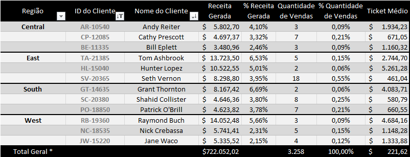

Para orientar os líderes regionais de vendas, identificamos os clientes com maior receita gerada em cada região em 2018:

- **CENTRAL**: **Andy Reiter** com US$ 5.802,70
- **EAST**: **Tom Ashbrook** com US$ 13.723,50
- **SOUTH**: **Grant Thornton** com US$ 8.167,42
- **WEST**: **Raymond Buch** com US$ 14.052,48

Confira a análise mais detalhada [aqui](./docs/PN5.md).

### [PN 6](./docs/PN6.md):

Analisamos o padrão das vendas ao longo do ano para orientar a equipe comercial na definição de estratégias mais eficazes. Os resultados são:

#### Meses com Maior Volume de Vendas de 2015 a 2018

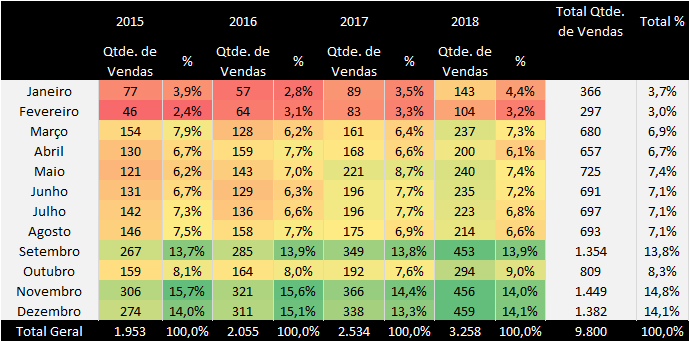

Os meses com maior volume de vendas de 2015 a 2018 foram:

1. **Novembro** com **14,8%** do total de vendas.
2. **Dezembro** com **14,1%** do total de vendas.
3. **Setembro** com **13,8%** do total de vendas.

#### Meses com Maior Receita de Vendas de 2015 a 2018

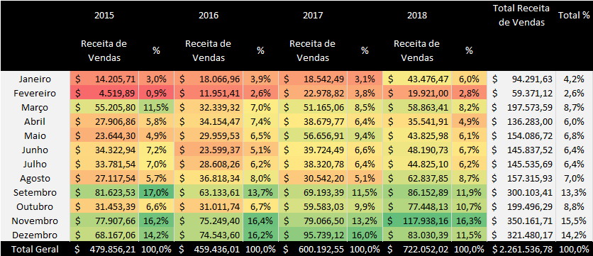

Os meses com maior receita de vendas gerada de 2015 a 2018 foram:

1. **Novembro** com **15,5%** do total.
2. **Dezembro** com **14,2%** do total.
3. **Setembro** com **13,3%** do total.

#### Trimestre com Maior Volume de Vendas de 2015 a 2018

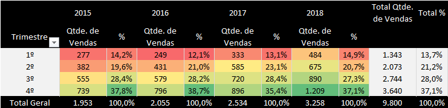

Foi identificado o trimestre com maior volume de vendas de 2015 a 2018. O ranking de maior a menor foi:

1. **4º trimestre** com **37,1%** do total de vendas.
2. **3º trimestre** com **28,0%** do total de vendas.
3. **2º trimestre** com **21,2%** do total de vendas.
4. **1º trimestre** com **13,7%** do total de vendas.

#### Volume Mensal de Vendas por Categoria de 2015 a 2018

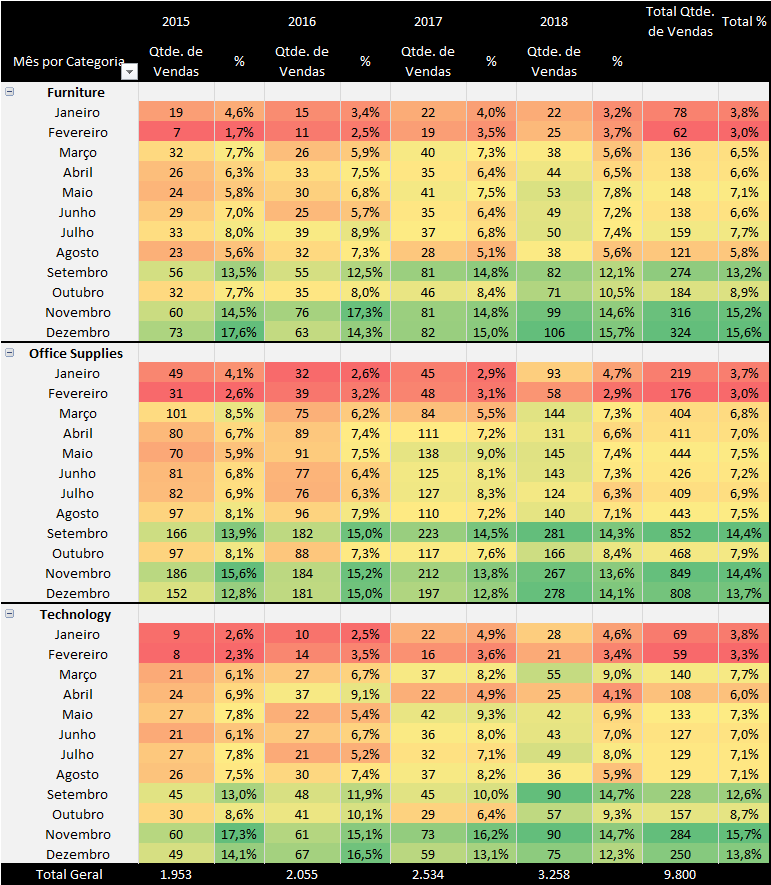

Para orientar os líderes da equipe comercial de cada categoria de produto, foi analisada a sazonalidade das vendas e os resultados foram os seguintes:

- **Furniture**
  - Os meses com maior volume de vendas nesta categoria são **Dezembro (15,6%)**, **Novembro (15,2%)** e **Setembro (13,2%)**.
  - O menor volume de vendas para esta categoria se encontra nos meses de **Fevereiro (3,0%)** e **Janeiro (3,8%)**.

- **Office Supplies**
  - O maior volume de vendas corresponde aos meses de **Setembro e Novembro, ambos com 14,4%** do total das vendas, seguidos por **Dezembro (13,7%)**.
  - Os meses de **Fevereiro (3,0%)** e **Janeiro (3,7%)** obtiveram o menor volume de vendas.

- **Technology**
  - O mês de **Novembro** se destaca com o maior volume de vendas (**15,7%** do total), seguido por **Dezembro (13,8%)** e **Setembro (12,6%)**.
  - O mês de **Fevereiro** tem o menor volume de vendas (**3,3%** do total), seguido por **Janeiro (3,8%)**.

#### Volume Mensal de Vendas por Região de 2015 a 2018

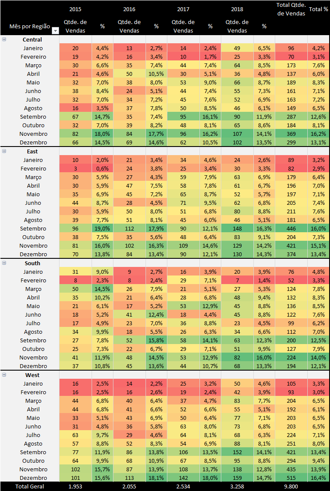

Com o objetivo de guiar comercialmente os líderes das equipes comerciais de cada região, foi analisada a sazonalidade das vendas e chegamos ao seguinte resultado:

- **Central**
  - Os meses com maior volume de vendas nesta região foram **Novembro (16,2%)**, **Dezembro (13,1%)** e **Setembro (12,6%)**.
  - As vendas apresentam uma redução nesta região para os meses de **Fevereiro (3,1%)** e **Janeiro (4,2%)**.

- **East**
  - O maior volume de vendas foi apresentado nos meses de **Setembro (16,0%)**, **Novembro (15,1%)** e **Dezembro (13,4%)**.
  - Nos meses de **Fevereiro (2,9%)** e **Janeiro (3,2%)** foi registrado o menor volume de vendas nesta região.

- **South**
  - O mês de **Novembro** registrou o maior volume de vendas no período (**14,0%** do total), seguido por **Setembro (12,5%)** e **Dezembro (12,1%)**.
  - O menor volume de vendas no período foi apresentado no mês de **Fevereiro (3,3%)** e no mês de **Janeiro (4,8%)**.

- **West**
  - **Dezembro** foi o mês com maior volume de vendas nesta região (**16,4%** do total), seguido por **Novembro (13,9%)** e **Setembro (13,4%)**.
  - Os meses de **Fevereiro (3,0%)** e **Janeiro (3,3%)** foram os que registraram menor volume de vendas no período.

Confira a análise mais detalhada [aqui](./docs/PN6.md).