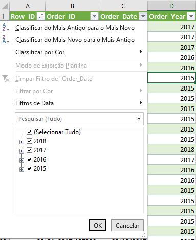
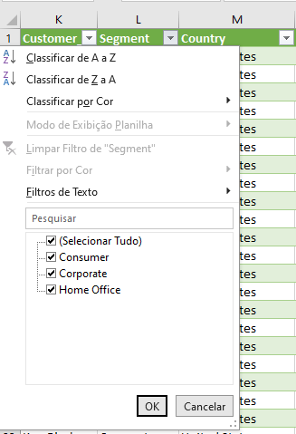
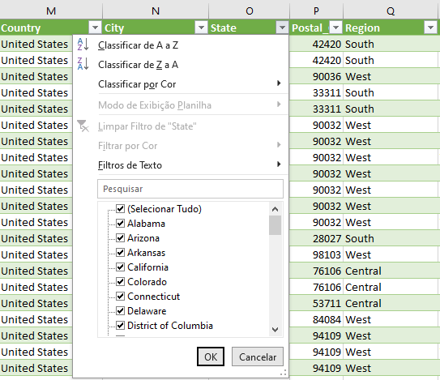
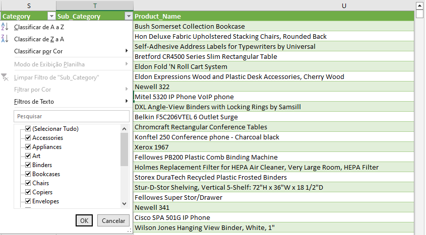
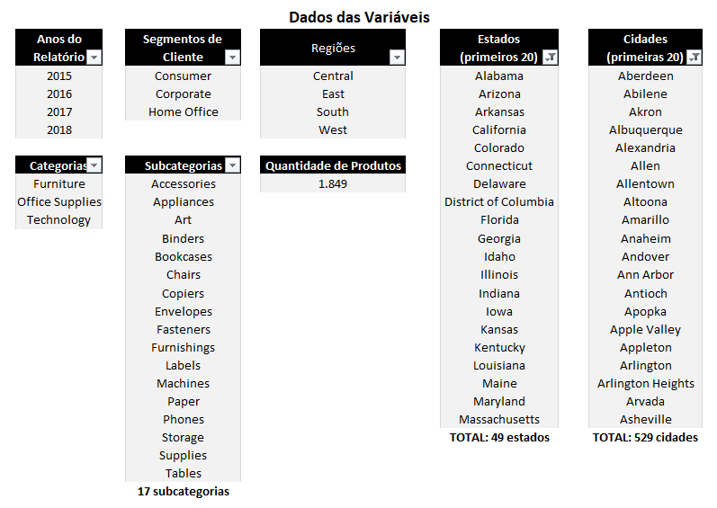
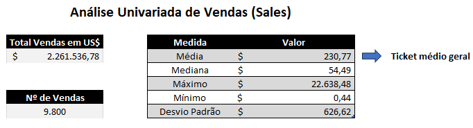
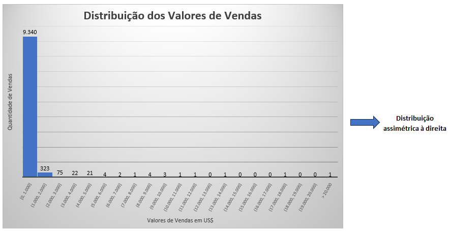

# Análise Inicial

Para familiarização com o conjunto de dados, realizamos uma análise rápida de cada variável. Uma forma prática é utilizar o filtro da planilha, que oferece uma visão geral dos valores em cada coluna.
Foram analisadas as seguintes variáveis:
- **Order_Date** e **Order_Year** para identificar os anos abrangidos pelo *dataset*;

- **Segment** para verificar os diferentes segmentos de clientes;

- Variáveis de localização como **Country**, **State**, **City** e **Region**, a fim de compreender a distribuição geográfica dos clientes;

- **Category**, **Sub_Category** e **Product_Name** para conhecer o portfólio de produtos comercializados pela empresa.

Utilizamos **tabelas dinâmicas** para listar os valores presentes em cada uma das variáveis mencionadas. O resultado obtido foi o seguinte:

---

## Análise Univariada de “Sales”

Analisamos a variável de vendas do dataset. Para isso, empregamos tabelas dinâmicas para totalizar o volume e o valor total das vendas. Também aplicamos as funções **MÉDIA**, **MED**, **MÁXIMO**, **MÍNIMO** e **DESVPAD.P** para calcular a média, mediana, valor máximo, valor mínimo e o desvio padrão das vendas.

Construímos um histograma com os dados da coluna *Sales* para visualizar a distribuição dos valores.

## Conclusão
Com base nos dados coletados, compilamos a seguinte tabela com as informações gerais mais relevantes do dataset antes de prosseguir com análises mais detalhadas:

