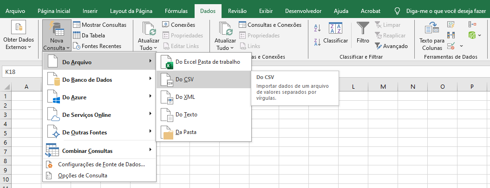
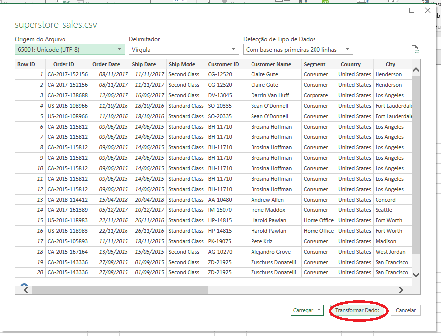
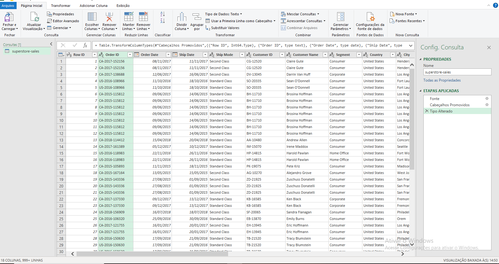
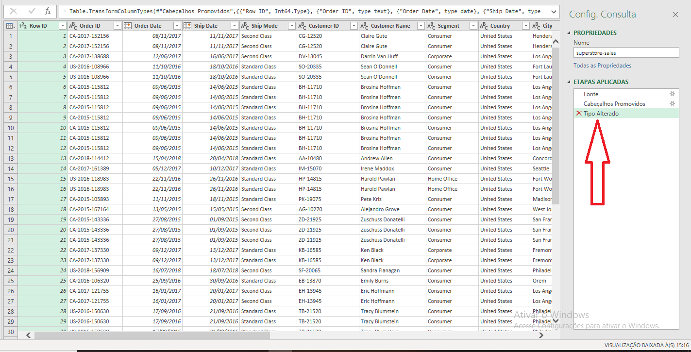
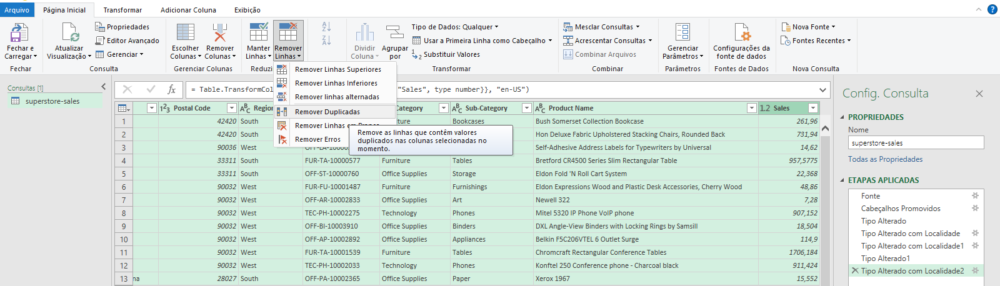
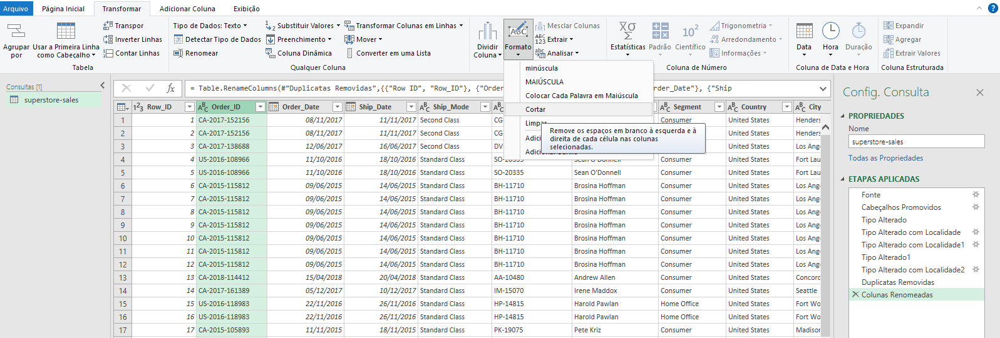
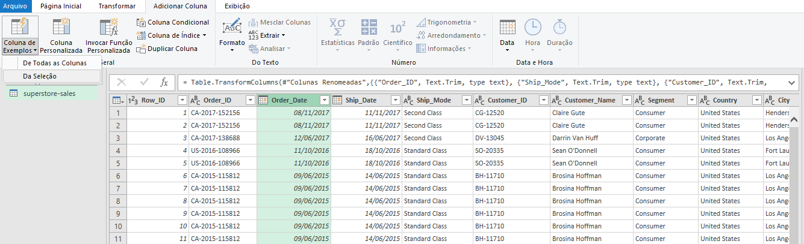
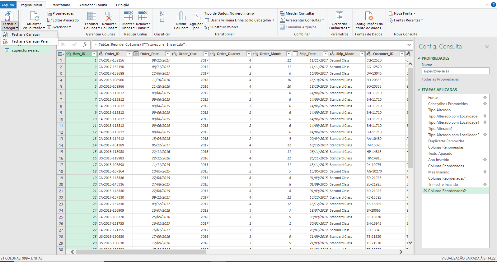
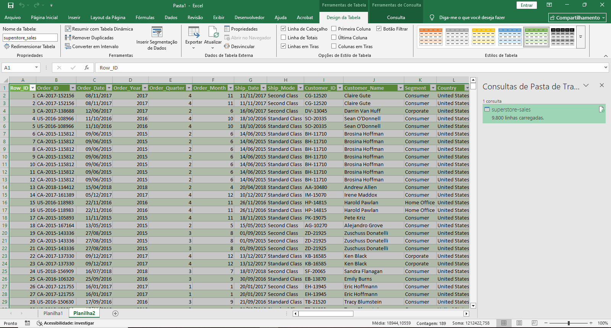
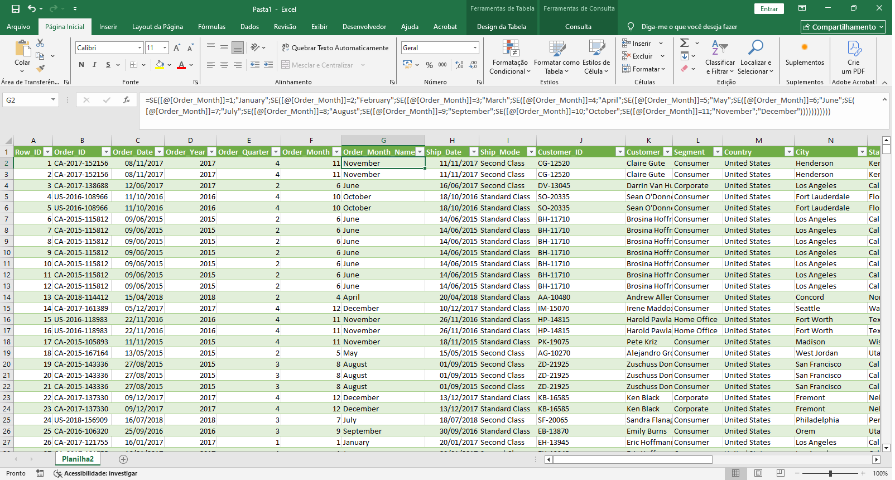

# Processo de ETL

Antes da análise exploratória, foi realizado o processo de ETL para preparar os dados utilizando o **Power Query do Excel**. As etapas executadas foram:

## Extração (Extract):
1. Criação de um novo arquivo em Excel e acesso à funcionalidade: **Dados > Obter Dados > De Arquivo > De CSV**

2. Seleção e importação do *dataset* previamente baixado do **Kaggle**

## Transformação (Transform):
3. Acesso ao editor do Power Query através da opção "**Transformar Dados**"

4. Retirar a etapa de alteração dos tipos de dados no Power Query, na aba de Etapas.

5. Definição manual dos tipos de dados apropriados para cada coluna:
**Colunas de data**: Configurado formato brasileiro (dd/mm/aaaa) usando a opção "**Usando a Localidade**"
**Valores numéricos**: Ajustado separador decimal de ponto para vírgula utilizando "**Usando a Localidade**"

6. Remoção de registros duplicados através da seleção de todas as colunas e aplicação de **Remover Linhas > Remover Duplicatas**

7. Padronização dos nomes das colunas substituindo espaços por *underscore* (_)

8. Aplicação da função **Transformar > Formato > Cortar** em colunas textuais para eliminar espaços extras

9. Criação de colunas derivadas da data de pedido (**Order_Year, Order_Month, Order_Quarter**) através de **Adicionar Coluna > Coluna de Exemplos > Da Seleção**

## Carregamento (Load) e Validação:
10. Carregamento dos dados tratados para o Excel mediante **Página Inicial > Fechar e Carregar**

11. Validação da integridade dos dados:
- Contagem total de registros: **9.800**
- Verificação de valores ausentes por coluna usando função **CONT.VALORES**. Alternativamente pode ser feito também com **CONTAR.VAZIO**
- Identificação de 11 registros sem valor na coluna **Postal_Code** (9.789 preenchidos). **Decisão**: Manter todos os registros, já que a coluna não seria usada para as análises planejadas no futuro. 

## Preparação Final para Análise:
12. Criação da coluna **Order_Month_Name** em inglês usando função **SE** para manter consistência linguística com o restante do *dataset*

13. Organização da planilha com renomeação da aba e salvamento do arquivo
