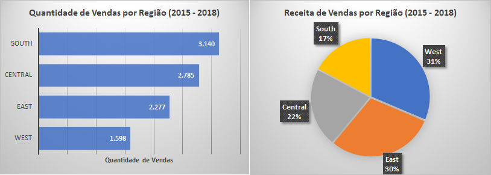
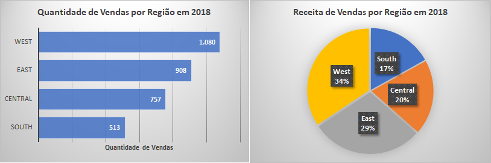
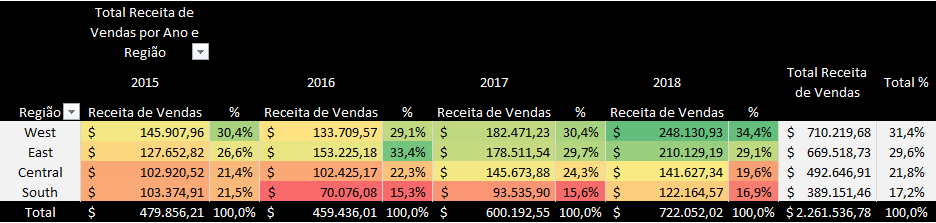
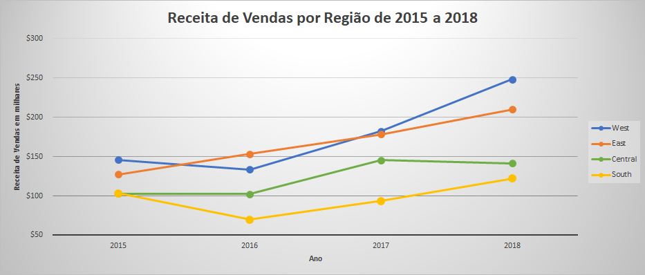
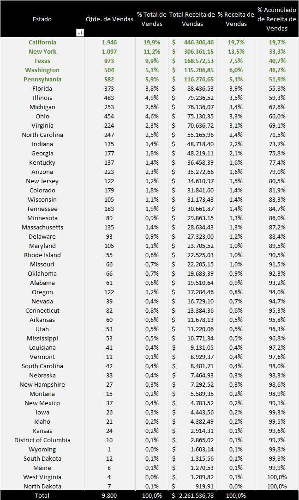
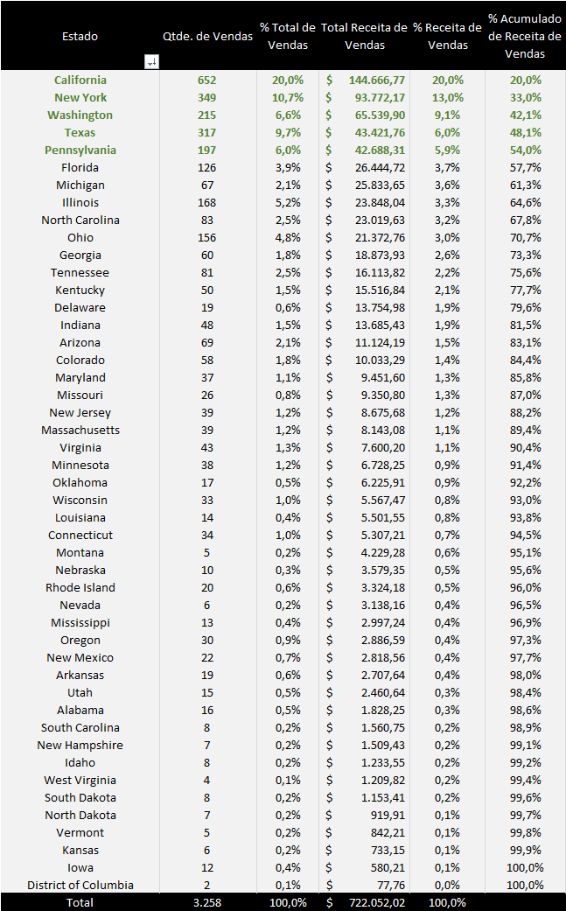
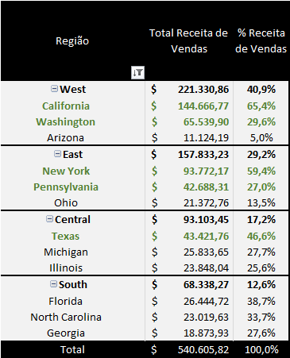
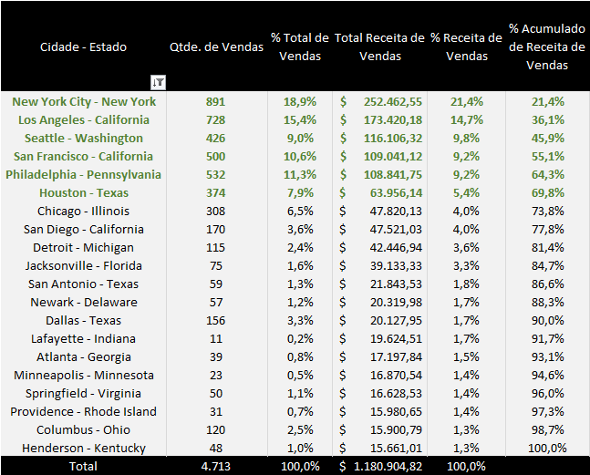
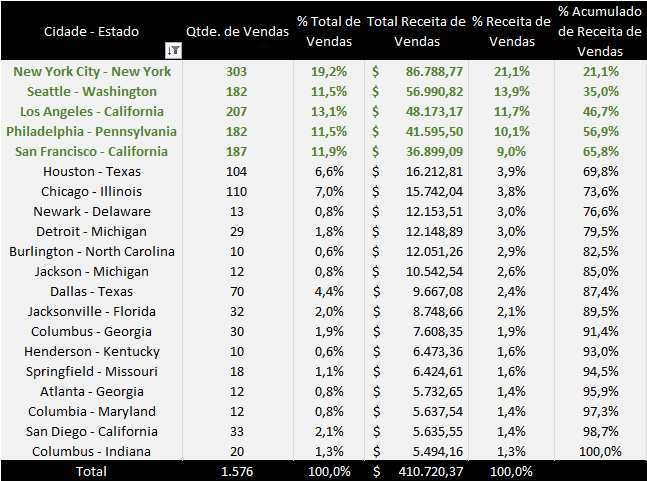
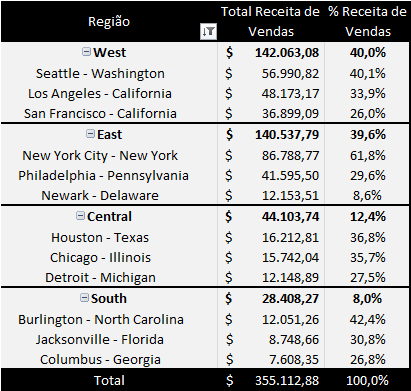

[< INÍCIO](../README.md)

# Pergunta de Negócio 1: Qual região, estado e cidade apresentam o maior volume de vendas?

Para responder a esta pergunta, **temos em consideração as variáveis relacionadas à localização da venda e à variável do valor da venda**. Utilizamos também algumas ferramentas da estatística, como tabelas de frequência (com tabelas dinâmicas), gráficos de barras, gráficos de pizza, gráficos de linha e mapa de calor.

## Análise de Vendas por Região

Realizamos a análise da quantidade de vendas e da receita de vendas de cada uma das 4 regiões durante os anos do relatório (2015 a 2018).

#### Análise de Vendas por Região de 2015 a 2018

#### Análise de Vendas por Região em 2018

- Percebemos que as regiões **West** e **East** estão à frente. A região com a maior quantidade de vendas é a **West**, com 32,0%. Por outro lado, a região **South** teve apenas 16,3%, ficando em último lugar.
- Quanto à receita de vendas, **West** destaca-se em primeiro lugar, com 31,4% da receita total da empresa, enquanto **South** ficou com 17,2%.
- <u>Quando analisamos apenas o último ano do relatório (2018), obtivemos que **West** teve 33,1% das 3.258 vendas no período, sendo a região com a maior quantidade de vendas</u>. A região **South** ficou com 15,7% das vendas no período.
- <u>Ao analisarmos a receita de vendas do ano de 2018, encontramos que a região com a maior receita foi **West**</u>, com 34,4% do total da companhia (US$ 722.052,00). A região **South** ficou em último lugar, com 16,9%.

#### Análise de Vendas por Região e por Ano

Através do mapa de calor, analisamos o comportamento da receita de vendas em cada uma das regiões de 2015 a 2018. Podemos observar o seguinte em cada região:
- **WEST:** Em 2015, foi a região com a maior receita de vendas da empresa. Em 2016, teve uma queda no valor absoluto e percentual (de 30,4% para 29,1%) da receita total da companhia no ano, caindo também para o segundo lugar em receita (atrás da região **East**). Esta região recuperou o primeiro lugar em 2017, com 30,4%, e aumentou para 34,4% em 2018.
- **EAST:** Esta região obteve o segundo lugar em receita de vendas no ano de 2015, com 26,6% do total das vendas da empresa. No segundo ano, teve um incremento para 33,4%, ficando em primeiro lugar. Nos anos 2017 e 2018, a região teve um aumento no valor absoluto da receita de vendas em comparação com o ano anterior, porém caiu para o segundo lugar da lista quanto à maior receita de vendas (com 29,7% e 29,1% da receita de vendas da companhia).
- **CENTRAL:** A região começou em 2015 com a menor porcentagem de receita de vendas da companhia, com 21,4%. Reduziu levemente o valor absoluto das vendas em 2016, porém ficou em 3º lugar em comparação com as outras regiões (devido à grande queda nas vendas da região **South** em 2016). Em 2017, observamos um grande aumento nas vendas da região, disparando o valor absoluto de 102 mil para 145 mil dólares (de 22,3% para 24,3% da receita total de vendas). No último ano, fechou em queda no valor absoluto e percentual.
- **SOUTH:** Em 2015, teve o 3º maior valor em receita de vendas, com 21,5% do total. No ano de 2016, a região sofreu uma queda considerável no valor absoluto e percentual das vendas. Em 2017, o setor aumentou a sua receita de vendas, indo de 70 mil para 93 mil dólares, porém permaneceu em último lugar entre as 4 regiões. Em 2018, esta região avançou mais, tanto no valor absoluto da sua receita como também no percentual, em comparação com o valor total das vendas da companhia, indo de 15,6% para 16,9% da receita de vendas da companhia.

No seguinte gráfico, também é possível ver a performance de vendas das diferentes regiões de 2015 a 2018.

## Análise de Vendas por Estado

Foi realizada uma análise das vendas considerando os registros de vendas dos 49 estados contidos no relatório. 

#### Análise de Vendas por Estado de 2015 a 2018

#### Análise de Vendas por Estado em 2018

Encontramos a seguinte informação:
- De 2015 a 2018, observamos que os estados com maior receita de vendas são **California**, **New York**, **Texas**, **Washington** e **Pennsylvania**. <u>Este Top 5 de estados com maior receita de vendas representa 51,9% da receita de vendas de toda a companhia no período</u>.
- <u>Quando analisamos a receita de vendas do último ano, encontramos os mesmos estados fazendo parte do Top 5 de maior receita de vendas</u>, apenas com **Washington** subindo para a 3ª posição no ranking (**Texas** caindo para a 4ª colocação). **Os 5 estados representam 54,0% da receita de vendas da companhia em 2018**.
- Em 2018, o Top 10 dos estados com maior receita de vendas é completado por **Florida**, **Michigan**, **Illinois**, **North Carolina** e **Ohio**.

A seguir, analisamos o **Top 3 dos estados com maior receita de vendas por região**:

#### Top 3 Estados com maior Receita de Vendas por Região em 2018

- Podemos concluir que 2 dos 5 estados com maior receita encontram-se na região **West** (**California** e **Washington**), enquanto outros 2 se encontram na região **East** (**New York** e **Pennsylvania**). O estado do **Texas**, que faz parte desse Top 5, encontra-se na região **Central**.
- Na região **West**, é visível que os estados da **California** e **Washington** alavancam o resultado da região. O mesmo acontece na região **East** com os estados de **New York** e **Pennsylvania**.

## Análise de Vendas por Cidade

Na seguinte tabela, podemos ver o <u>Top 20 das cidades com maior receita de vendas da companhia de 2015 a 2018</u>. 

#### Top 20 Cidades com maior Receita de Vendas de 2015 a 2018

Destacamos principalmente as primeiras 6 cidades (**New York City**, **Los Angeles**, **Seattle**, **San Francisco**, **Philadelphia** e **Houston**), que proporcionam 69,9% da receita de vendas do total no Top 20 da companhia.

#### Top 20 Cidades com maior Receita de Vendas em 2018

Também analisamos os dados do Top 20 no ano de 2018, observando o crescimento no ranking das cidades de **Seattle** e **Philadelphia** quando comparado com o período completo de 2015 a 2018.

#### Top 3 Cidades com maior Receita de Vendas por Região em 2018

Quando analisamos as cidades com maior receita de vendas por cada região em 2018, encontramos o seguinte:
- **WEST:** As cidades de **Seattle**, **Los Angeles** e **San Francisco** alavancam o resultado do estado em proporções similares.
- **EAST:** A cidade de **New York City** é a que mais proporciona receita de vendas, por uma grande margem, quando comparada com as outras cidades da região. **Philadelphia** (2ª no ranking) ainda tem um valor alto de receita de vendas em comparação com as cidades do país.
- **CENTRAL:** As 3 primeiras cidades do ranking (**Houston**, **Chicago** e **Detroit**) têm uma contribuição similar à receita da região.
- **SOUTH:** A cidade de **Burlington** na **North Carolina** é a cidade com maior receita de vendas da região, seguida por **Jacksonville** na **Florida** e **Columbus** na **Georgia**. As 3 cidades aparecem no Top 20 nacional de cidades com maior receita de vendas em 2018.

## Conclusões:
### Vendas por Região
A região com maior receita de vendas ao longo do tempo é a **West** (31,4%), seguida pela **East** (29,6%). A margem aumenta quando consideramos apenas o último ano (2018), em que **West** tem 34,4% da receita de vendas da companhia, enquanto **East** continua em segundo lugar, com 29,1%.

### Vendas por Estado
Os estados com maior receita de vendas, considerando os registros de 2015 a 2018, são:
1.	**California**, com 19,7%.
2.	**New York**, com 13,5%.
3.	**Texas**, com 7,5%.

Se considerarmos apenas o último ano (2018), o ranking modifica-se apenas no terceiro estado do ranking:
1.	**California**, com 20,0%.
2.	**New York**, com 13,0%.
3.	**Washington**, com 9,1%.

Os estados mais destacados em sua região quanto à receita de vendas em 2018 foram:

- **California** e **Washington** na região **West**.
- **New York** e **Pennsylvania** na região **East**.
- **Texas** na região **Central**.
- **Florida** e **North Carolina** na região **South**.

### Vendas por Cidade
As cidades com maior receita de vendas a nível nacional de 2015 a 2018 foram:
1.	**New York City**
2.	**Los Angeles**
3.	**Seattle**
4.	**San Francisco**
5.	**Philadelphia**
6.	**Houston**

Quando analisado apenas o ano de 2018, o ranking continua com as mesmas cidades, porém em ordem diferente:
1.	**New York City**
2.	**Seattle**
3.	**Los Angeles**
4.	**Philadelphia**
5.	**San Francisco**
6.	**Houston**

Também em 2018, as cidades destacadas de cada região foram:
- **Seattle**, **Los Angeles** e **San Francisco** na região **West**.
- **New York** e **Philadelphia** na região **East**.
- **Houston**, **Chicago** e **Detroit** na região **Central**.
- **Burlington**, **Jacksonville** e **Columbus** na região **South**.

