[< INÍCIO](../README.md)

# Pergunta de Negócio 2: Quais são as categorias e subcategorias de produtos com melhor desempenho em vendas?

Com o objetivo de responder a esta pergunta, analisamos as variáveis relacionadas à **Categoria** e **Subcategoria** de produto, juntamente com a variável do valor de venda.

## Análise de Vendas por Categoria

Foram analisadas as vendas da empresa de 2015 a 2018 em cada uma das 3 categorias. Os resultados foram os seguintes:

#### Receita de Vendas por Categoria (2015 a 2018)
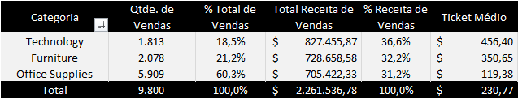

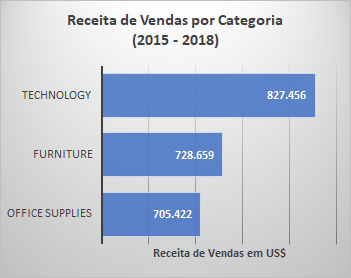

<u>Em relação à quantidade de vendas, a categoria com maior volume é *Office Supplies*</u>, com 5.909 vendas, correspondendo a 60,3%, seguida por *Furniture*, com 2.078 vendas (21,2%). Por último, temos *Technology*, com 1.813 vendas (18,5%) no período.

Ao mesmo tempo, observamos que, <u>em termos de geração de receita em dólares, a ordem se inverte</u>: *Technology* contribui com 36,6% da receita total da companhia, seguida por *Furniture* (32,3%) e, por último, *Office Supplies* (31,2%). Concluímos, assim, que o *Ticket Médio* da categoria *Technology* é maior, enquanto *Office Supplies* possui um *Ticket Médio* de menor valor.

#### Receita de Vendas por Categoria em 2018
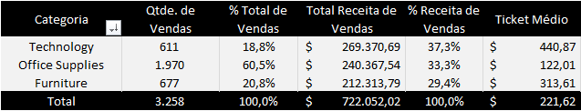

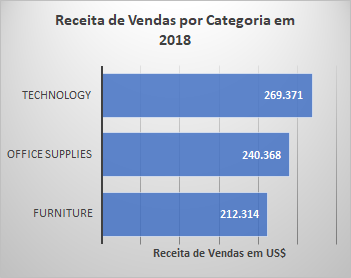

A análise também foi realizada para o ano de 2018, a fim de verificar a tendência de vendas por categoria no último ano do relatório. Quanto à quantidade de vendas, a ordem se mantém: *Office Supplies* com 60,5%, *Furniture* com 20,8% e *Technology* com 18,8%. Em relação à receita gerada, *Technology* permanece em primeiro lugar, com 37,3%, seguida por *Office Supplies* (33,3%) e *Furniture* (29,4%).

Por meio do mapa de calor, podemos acompanhar o desempenho da receita de vendas gerada por cada categoria entre 2015 e 2018.

#### Receita de Vendas por Categoria por Ano
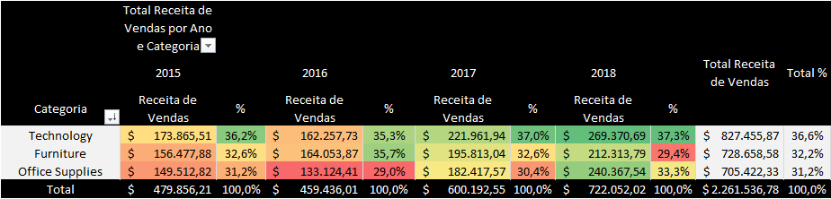

A categoria *Technology* teve a maior receita em 2015, com 36,2% do total, seguida por *Furniture* (32,6%) e *Office Supplies* (31,2%).

Em 2016, *Technology* apresentou redução no valor absoluto e percentual, com 35,3% da receita, caindo para o segundo lugar, atrás de *Furniture* (35,7%). *Office Supplies* também registrou queda no valor absoluto (de US$ 149 mil para US$ 133 mil) e no percentual (de 31,2% para 29,0%). Nota-se que 2016 foi o ano com a menor receita de vendas gerada pela companhia.

No ano de 2017, houve crescimento na receita em todas as categorias. *Technology* retomou a primeira posição, com 37,0%, seguida por *Furniture* (32,6%) e *Office Supplies* (30,4%).

Em 2018, todas as categorias apresentaram crescimento, com destaque para *Office Supplies* e, em menor proporção, *Technology*. Esta última registrou 37,3% da receita total, seguida por *Office Supplies* (33,3%) e *Furniture* (29,4%).

A performance de vendas de cada categoria entre 2015 e 2018 também pode ser conferida no seguinte gráfico de linhas:

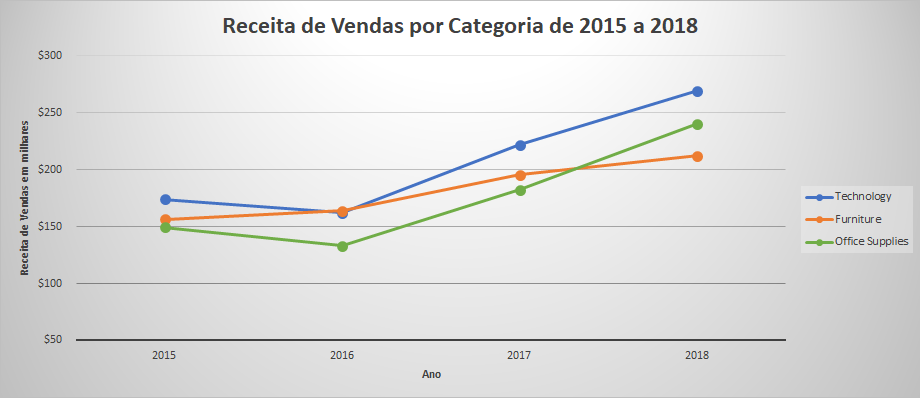

## Análise de Vendas por Subcategoria

Também foram analisadas as subcategorias e sua relação com o volume de vendas e a receita gerada.

#### Receita de Vendas por Subcategoria de 2015 a 2018
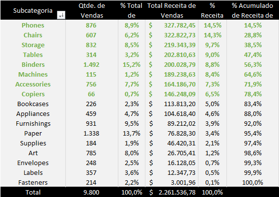

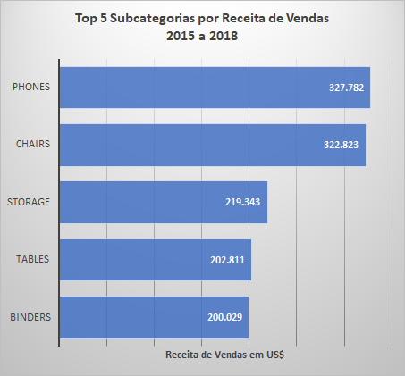

De 2015 a 2018, as subcategorias com maior receita de vendas foram:

1. *Phones* com 14,5%

2. *Chairs* com 14,3%

3. *Storage* com 9,7%

4. *Tables* com 9,0%

5. *Binders* com 8,8%

A soma da receita gerada por essas 5 subcategorias representa 56,3% da receita total da companhia.

#### Receita de Vendas por Subcategoria em 2018
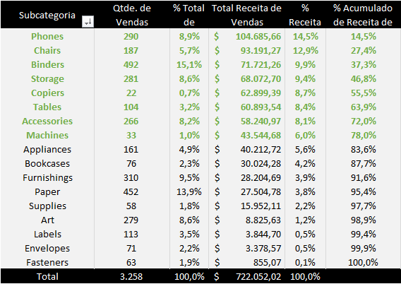

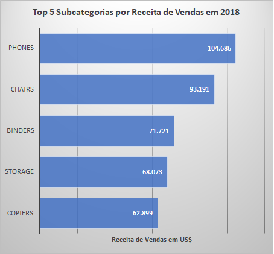

Posteriormente, analisamos as subcategorias no ano de 2018 e concluímos que a maior receita de vendas foi gerada por:

1. *Phones* com 14,5%

2. *Chairs* com 12,9%

3. *Binders* com 9,9%

4. *Storage* com 9,4%

5. *Copiers* com 8,7%

A combinação da receita dessas 5 subcategorias totaliza 55,5% da receita geral. Também observamos um aumento significativo na receita gerada pela subcategoria *Copiers*.

## Análise das Vendas de Subcategorias por Categoria

Ao analisarmos as duas variáveis em 2018, considerando apenas subcategorias com receita acima de US$ 40 mil, obtivemos as seguintes informações:

#### Receita de Vendas das Subcategorias e Categorias em 2018 (acima de 40 mil US$)
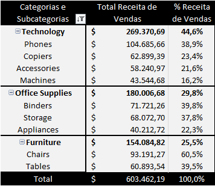

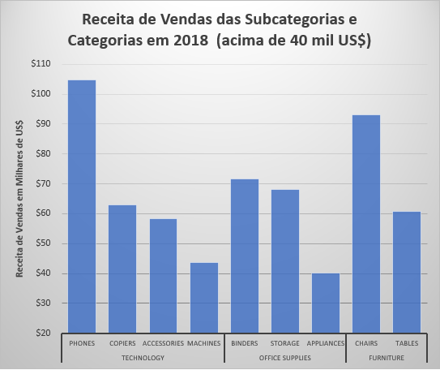

Na categoria **Technology**, destacam-se as subcategorias *Phones*, *Copiers*, *Accessories* e *Machines*.

Em **Office Supplies**, as subcategorias com maior receita foram *Binders* e *Storage*, seguidas por *Appliances*.

Em **Furniture**, destacam-se *Chairs* e *Tables*.

## Análise das Vendas de Subcategorias por Região

Com o objetivo de orientar a equipe de vendas de cada região, analisamos a receita gerada em 2018 por subcategoria nas 4 regiões.

#### Top 3 Subcategorias com maior Receita de Vendas por Região em 2018
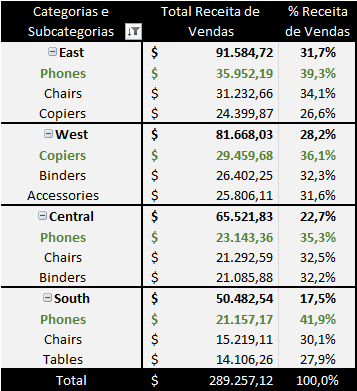

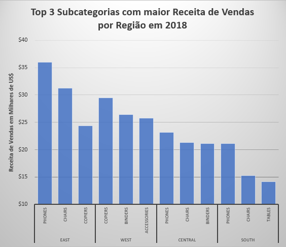

**EAST:** Se destacaram *Phones*, *Chairs* e *Copiers*

**WEST:** A maior receita de vendas foi gerada por *Copiers*, *Binders* e *Accessories*

**CENTRAL:** Os destaques da região foram *Phones*, *Chairs* e *Binders*

**SOUTH:** Se destacaram *Phones*, *Chairs* e *Tables*

## Conclusões

### Vendas por Categoria
A categoria que mais se destaca em receita de vendas é **Technology**, que, entre 2015 e 2018, gerou 36,6% do valor total. No último ano (2018), esse percentual aumentou para 37,3%. Essa categoria também possui o maior *Ticket Médio* entre as três: US$ 440,87 por produto.

### Vendas por Subcategoria
Duas subcategorias se destacam em receita de vendas no período de 2015 a 2018: **Phones** (14,5%) e **Chairs** (14,3%). Ambas mantêm a liderança ao analisarmos apenas 2018, com **Phones** representando 14,5% e **Chairs**, 12,9%.

### Vendas das Subcategorias por Categoria
Para orientar as equipes responsáveis por cada categoria, analisamos a receita de 2018 por subcategoria. As subcategorias com a maior receita de vendas para cada categoria são:

**Technology:** *Phones*, *Copiers*, *Accessories* e *Machines*

**Office Supplies:** *Binders*, *Storage* e *Appliances*

**Furniture:** *Chairs* e *Tables*

### Vendas das Subcategorias por Região
Com o intuito de guiar os líderes regionais, analisamos a receita de 2018 por subcategoria em cada região. As subcategorias com a maior receita de vendas para cada região são:

**EAST:** *Phones*, *Chairs* e *Copiers*

**WEST:** *Copiers*, *Binders* e *Accessories*

**CENTRAL:** *Phones*, *Chairs* e *Binders*

**SOUTH:** *Phones*, *Chairs* e *Tables*