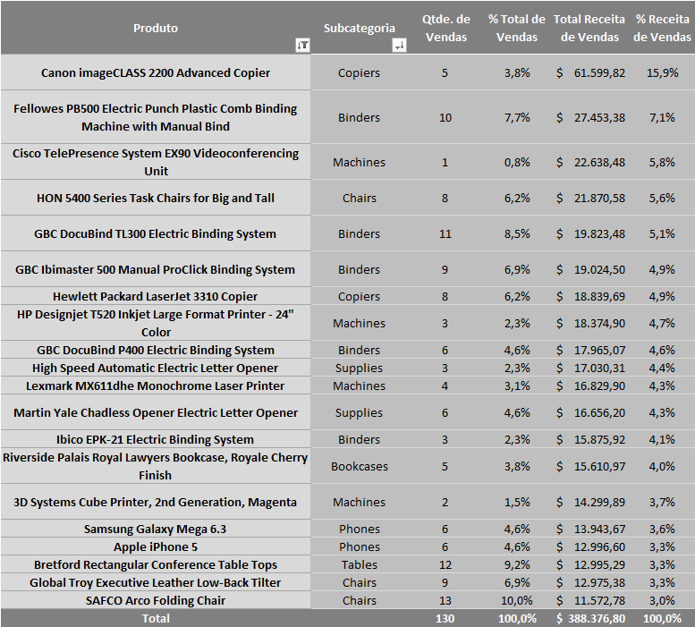
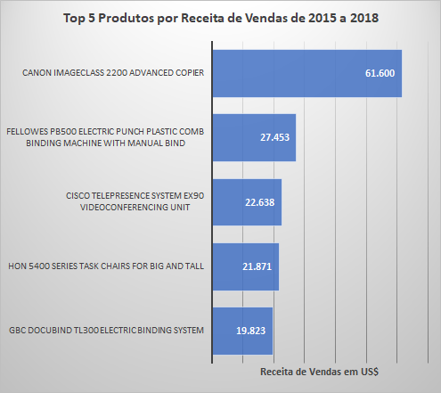
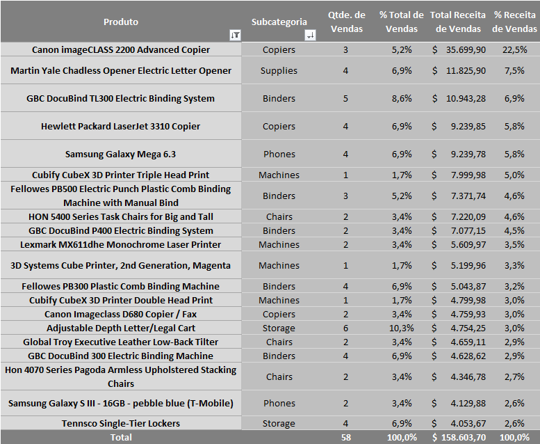
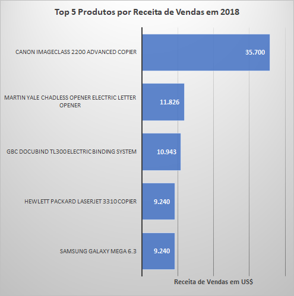
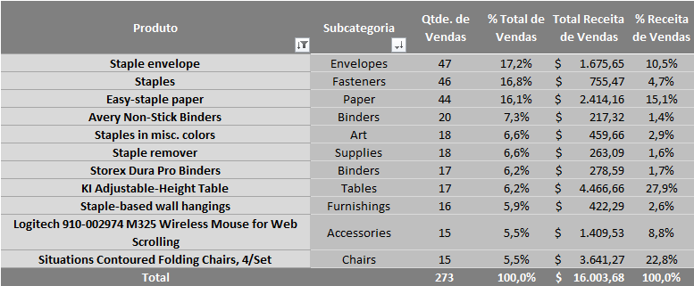
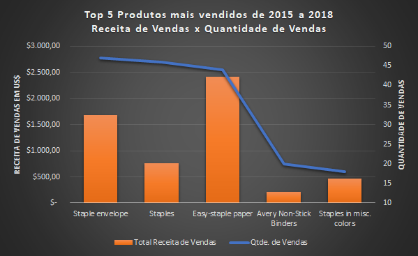
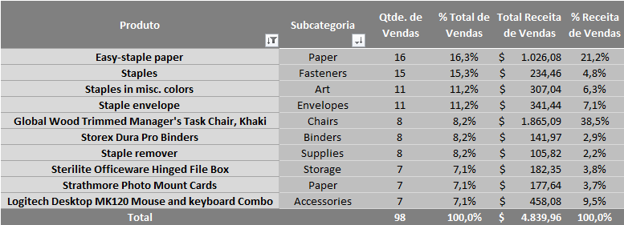
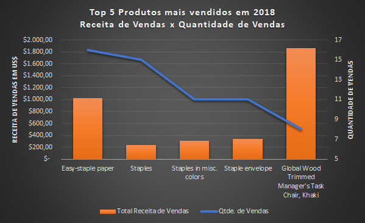
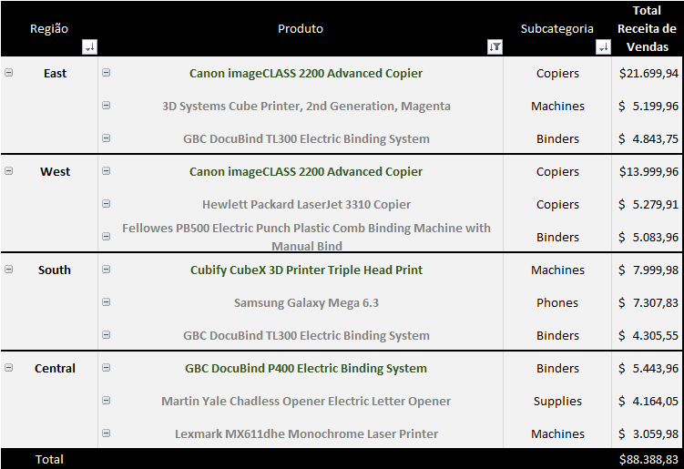
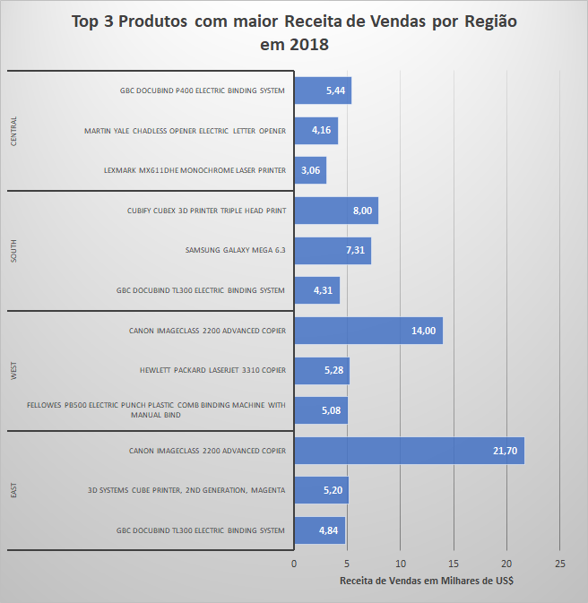

[< INÍCIO](../README.md)

# Pergunta de Negócio 3: Qual produto gera a maior receita?

Para responder a esta pergunta, analisamos a variável *Product_Name* junto com a variável de valor da venda, para assim identificarmos os produtos mais vendidos na companhia.

## Vendas por Produto

Em primeiro lugar, analisamos os produtos que geraram maior receita de vendas de 2015 a 2018. O resultado foi o seguinte:

#### Top 20 Produtos com maior Receita de Vendas (a nível nacional) de 2015 a 2018

O produto que mais receita gerou no período foi o *Canon imageCLASS 2200 Advanced Copier*, que pertence à subcategoria **Copiers**, com um valor superior a 60 mil dólares. Atrás deste produto encontram-se três produtos acima dos 20 mil dólares de receita gerada: *Fellowes PB500 Electric Punch Plastic Comb Binding Machine with Manual Bind*, *Cisco TelePresence System EX90 Videoconferencing Unit* e *HON 5400 Series Task Chairs for Big and Tall*. Os quatro produtos mencionados totalizam um valor superior a 133 mil dólares. Vale destacar que dois deles pertencem à categoria **Technology**, que é a categoria com maior receita de vendas gerada na companhia.

A receita de vendas por produto também foi analisada para o ano de 2018. Obtivemos os seguintes resultados:

#### Top 20 Produtos com maior Receita de Vendas (a nível nacional) em 2018

O produto com maior receita de vendas foi o *Canon imageCLASS 2200 Advanced Copier* (Copiers). Destacamos também no Top 5 os produtos *Martin Yale Chadless Opener Electric Letter Opener* (Office Supplies), *GBC DocuBind TL300 Electric Binding System* (Office Supplies), *Hewlett Packard LaserJet 3310 Copier* (Copiers) e *Samsung Galaxy Mega 6.3* (Phones). Como podemos observar, três desses produtos pertencem à categoria **Technology**, enquanto os outros dois pertencem à categoria **Office Supplies**.

Neste levantamento, podemos também concluir que os produtos com maior receita de vendas têm um *Ticket Médio* alto, com “poucas” vendas, porém com valores altos de receita.

Por essa razão, analisamos os produtos com maior quantidade de vendas de 2015 a 2018. Os resultados foram os seguintes:

#### Top 10 Produtos com maior Quantidade de Vendas (a nível nacional) de 2015 a 2018

O produto com mais vendas no período foi *Staple envelope* (47), seguido por *Staples* (46). Em terceiro lugar está *Easy-staple paper*, com 44 vendas. Os três produtos mencionados fazem parte da categoria **Office Supplies**. Também podemos destacar, nesta lista dos 10 produtos com mais vendas realizadas, o *KI Adjustable-Height Table*, com 17 vendas e mais de 4 mil dólares em receita, e o *Situations Contoured Folding Chairs, 4/Set*, com 15 vendas e mais de 3 mil dólares em receita de vendas. Estes dois últimos produtos fazem parte da categoria **Furniture**.

Realizamos a análise dos produtos mais vendidos no ano de 2018.

#### Top 10 Produtos com maior Quantidade de Vendas (a nível nacional) em 2018

Observamos que, dentre os produtos mais vendidos, destacam-se *Easy-staple paper*, com 16 vendas e US$ 1.026,08 em receita de vendas. *Staples* também se destaca, com 15 vendas, porém com uma receita em dólares menor (US$ 234,46). Destaca-se o quinto produto mais vendido em 2018, o *Global Wood Trimmed Manager's Task Chair, Khaki* que teve 8 vendas e uma receita de US$ 1.865,09.

Para orientar a equipe comercial de cada região, destacamos os produtos mais vendidos em cada uma delas:

#### Top 3 Produtos com maior Receita de Vendas por Região em 2018

**EAST:** O produto com maior receita de vendas gerada foi *Canon imageCLASS 2200 Advanced Copier*, da categoria **Technology**. 

**WEST:** A maior receita foi gerada também pela *Canon imageCLASS 2200 Advanced Copier*, da categoria **Technology**.

**SOUTH:** O produto *Cubify CubeX 3D Printer Triple Head Print*, da categoria **Technology**, obteve a maior receita de vendas da região.

**CENTRAL:** O produto com maior receita de vendas foi *GBC DocuBind P400 Electric Binding System*, da categoria **Office Supplies**.

Podemos observar no levantamento como a categoria **Technology** se destaca principalmente em três das quatro regiões (**East**, **West** e **South**, com dois produtos no Top 3). Por outro lado, dois produtos do Top 3 na região **Central** pertencem à categoria **Office Supplies**.

## Conclusões

Identificar os produtos com maior número de vendas e maior receita de vendas é importante para que os líderes regionais e de cada categoria de produto possam tomar decisões assertivas no futuro.

### Vendas por Produto

Os produtos com maior receita de vendas no período de 2015 a 2018 foram:

1. *Canon imageCLASS 2200 Advanced Copier*, que pertence à categoria **Technology**.

2. *Fellowes PB500 Electric Punch Plastic Comb Binding Machine with Manual Bind*, da categoria **Office Supplies**.

3. *Cisco TelePresence System EX90 Videoconferencing Unit*, que pertence à categoria **Technology**.

Em 2018, os produtos com maior receita de vendas foram:

1. *Canon imageCLASS 2200 Advanced Copier*, que pertence à categoria **Technology**.

2. *Martin Yale Chadless Opener Electric Letter Opener*, da categoria **Office Supplies**.

3. *GBC DocuBind TL300 Electric Binding System*, também da categoria **Office Supplies**.

Como vemos nos períodos analisados, destacam-se produtos da categoria **Technology**, seguidos pela categoria **Office Supplies**.

Quando consideramos a quantidade de vendas realizadas, de 2015 a 2018 destacam-se os seguintes produtos:

1. Staple envelope (47 vendas).

2. Staples (46 vendas).

3. Easy-staple paper (44 vendas).

Em 2018, repetem-se alguns produtos no Top 3 de mais vendas:

1. Easy-staple paper (16 vendas).

2. Staples (15 vendas).

3. Staples in misc. Colors e Staple envelope (11 vendas).

### Vendas de Produtos por Região

Foram identificados os produtos com maior receita de vendas em cada região no ano de 2018. O resultado foi o seguinte:

- O produto com maior receita de vendas em **EAST** foi o *Canon imageCLASS 2200 Advanced Copier*, da categoria **Technology**.

- O produto com maior receita de vendas em **WEST** também foi o *Canon imageCLASS 2200 Advanced Copier*, da categoria **Technology**.

- O produto com maior receita de vendas em **SOUTH** foi o *Cubify CubeX 3D Printer Triple Head Print*, da categoria **Technology**.

- O produto com maior receita de vendas na região **CENTRAL** foi o *GBC DocuBind P400 Electric Binding System*, da categoria **Office Supplies**.