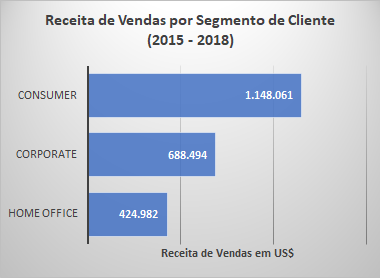
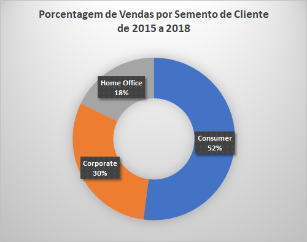
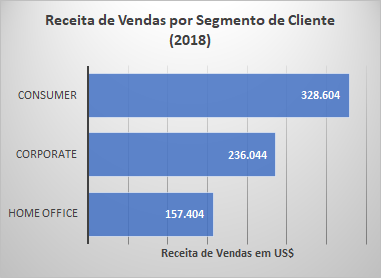
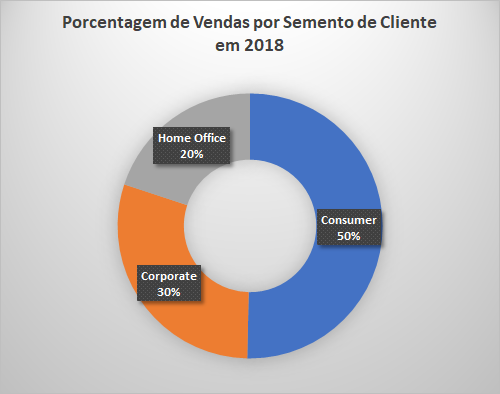
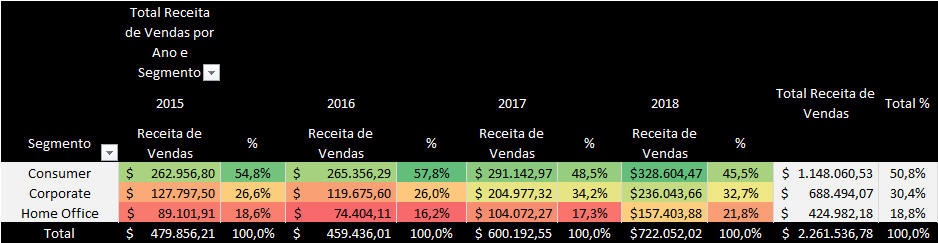
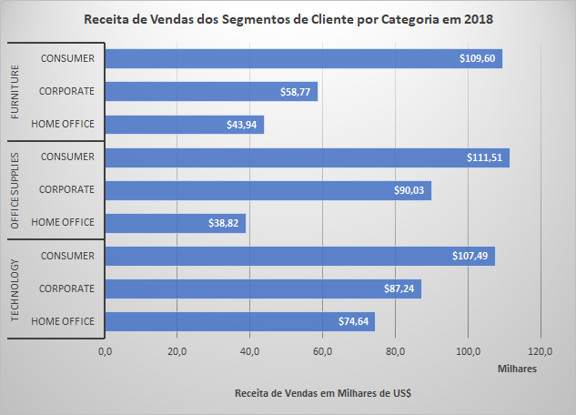
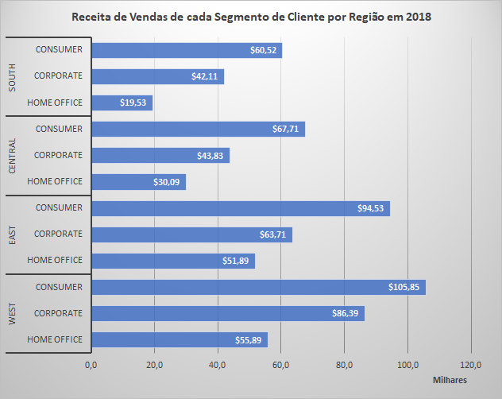

[< INÍCIO](../README.md)

# Pergunta de Negócio 4: Qual segmento de cliente possui o maior volume de compras?

Nesta etapa, analisamos a variável **Segment** em conjunto com a variável de valor das vendas para identificar quais são os segmentos que geram maior volume de vendas e receita.

## Vendas por Segmento de Cliente

Aqui observamos o comportamento das vendas entre 2015 e 2018 para cada segmento de clientes. Também identificamos qual é o **Ticket Médio** para cada um deles e obtivemos a seguinte informação:

### Vendas por Segmento de Cliente de 2015 a 2018

O segmento de clientes com maior volume de compras foi **Consumer**, gerando um total de **5.101 compras**. Essas compras representaram **50,8%** do valor total da receita de vendas da companhia. Por outro lado, o **Ticket Médio** deste segmento foi o menor dos três (**US$ 225,07**).

O segundo segmento em volume de vendas foi **Corporate**, com **2.953 vendas** e **30,4%** da receita da empresa no período. O **Ticket Médio** foi o segundo maior em comparação aos outros dois segmentos.

Por último, o segmento **Home Office** obteve **1.746 vendas** no período, gerando **18,8%** da receita total da companhia. O **Ticket Médio** para este segmento foi o maior, com **US$ 243,40**.

Também analisamos os dados de vendas apenas para o último ano do relatório (2018).

### Vendas por Segmento de Cliente em 2018

Em 2018, o segmento com maior volume de compras foi **Consumer**, com **1.640 vendas**. Essas compras geraram **45,5%** da receita da companhia no ano, com um **Ticket Médio** de **US$ 200,37**.

Em segundo lugar ficou o segmento **Corporate**, com **969 compras**, que geraram **32,7%** da receita total. O seu **Ticket Médio** foi de **US$ 243,60** — o mais alto entre os segmentos.

Em terceiro lugar ficou o segmento **Home Office**, com **649 compras** em 2018, responsável por **21,8%** da receita da companhia no período. O **Ticket Médio** deste segmento foi de **US$ 242,53**.

## Receita de Vendas em cada Segmento de Cliente Ano a Ano

Foi analisado o comportamento da **Receita de Vendas** gerada por cada **Segmento de Cliente** a cada ano do relatório. Para facilitar a visualização, utilizamos o seguinte mapa de calor:

### Receita de Vendas por Segmento de Cliente por Ano

Em **2015**, o segmento **Consumer** obteve **54,8%** da receita da companhia, seguido por **Corporate** (**26,6%**) e **Home Office** (**18,6%**).

Em **2016**, houve queda no valor absoluto da receita em dois dos três segmentos. O segmento **Consumer** teve um leve crescimento, passando de **US$ 262 mil** para **US$ 265 mil** de receita, gerando **57,8%** da receita total da companhia. O segmento **Corporate** teve queda no valor e gerou **26,0%** da receita total. Já **Home Office** também apresentou queda em comparação a 2015, gerando **16,2%** da receita total.

Em **2017**, os três segmentos aumentaram a receita em comparação aos anos anteriores. **Consumer** foi o segmento com maior receita, equivalente a **48,5%** do total da empresa. **Corporate** gerou **34,2%** e **Home Office**, **17,3%**.

No último ano do relatório (**2018**), os segmentos mantiveram o crescimento no valor absoluto da receita. O segmento **Consumer** gerou **45,5%**, **Corporate** gerou **32,7%** e **Home Office** gerou **21,8%** da receita total.

Podemos também observar a tendência da receita ano a ano no seguinte gráfico:

## Análise de Segmento de Cliente por Categoria

A seguir, analisamos o comportamento da receita de vendas de cada segmento de cliente **por categoria de produto** em 2018.

### Receita de Vendas de cada Segmento de Cliente por Categoria em 2018

Buscando orientar a equipe de vendas de cada categoria, observamos a distribuição de receita por segmento de clientes:

- **Technology**: Nesta categoria — a que mais gera receita —, o segmento **Consumer** é o maior gerador. *No entanto, se comparado às outras categorias, os volumes de receita entre os segmentos são mais equilibrados* (**Consumer** com **39,9%** e **Home Office** com **27,7%**).

- **Office Supplies**: Nesta categoria, os segmentos com maior receita são **Consumer** (**46,4%**) e **Corporate** (**37,5%**).

- **Furniture**: Aqui, o segmento **Consumer** é o maior gerador de receita por uma ampla margem, representando **51,6%** do total. Em seguida vêm **Corporate** (**27,7%**) e **Home Office** (**20,7%**).

## Análise de Segmento de Cliente por Região

Com o objetivo de orientar a equipe comercial de cada região, obtivemos também os valores da receita de vendas gerada por cada segmento de cliente **em cada região** em 2018. Os resultados foram os seguintes:

### Receita de Vendas por Segmento de Cliente por Região em 2018

- **WEST**: O segmento com maior receita foi **Consumer**, com **42,7%** da receita total da região.
- **EAST**: Nesta região, **Consumer** também foi o maior gerador, com **45,0%** da receita total.
- **CENTRAL**: O segmento com maior receita foi **Consumer**, com **47,8%** da receita total.
- **SOUTH**: **Consumer** também liderou, representando **49,5%** da receita gerada na região.

## Conclusões

Através da análise das vendas para cada segmento de clientes, podemos orientar as equipes comerciais (tanto a principal, quanto as de cada categoria de produtos ou regionais) para alavancar os resultados da empresa. Analisamos as vendas de cada segmento da seguinte maneira:

### Análise de Vendas por Segmento de Cliente

Ao observar o comportamento das vendas por segmento de cliente de 2015 a 2018, obtemos que:

- O segmento com maior volume de vendas é **Consumer**, com **52,1%** das vendas, que geraram **50,8%** da receita total da companhia no período.

Quando analisamos as vendas de 2018, o resultado foi:

- **Consumer** continua sendo o segmento com maior volume de vendas, com **50,3%** das vendas da companhia, que equivalem a **45,5%** da receita total da empresa.

Em relação à tendência das vendas ano a ano, concluímos que os três segmentos tiveram estagnação (no caso de **Consumer**) ou redução (no caso de **Corporate** e **Home Office**) das vendas em **2016**. Em 2017 e 2018, todos os segmentos apresentaram crescimento na receita gerada.

#### Vendas por Segmento de Cliente por Categoria em 2018

- **Technology**: **Consumer** é o segmento com maior geração de receita de vendas no período. *Os segmentos dentro desta categoria são equilibrados em termos de geração de receita.*

- **Office Supplies**: Os segmentos com maior receita gerada foram **Consumer** e **Corporate**.

- **Furniture**: Por uma ampla margem, o segmento com maior receita gerada foi **Consumer**.

#### Vendas por Segmento de Cliente por Região em 2018

O segmento de clientes com maior receita de vendas gerada em cada região foi:

- **WEST**: **Consumer** com **42,7%** da receita total gerada no período.
- **EAST**: **Consumer** com **45,0%** da receita total gerada no período.
- **CENTRAL**: **Consumer** com **47,8%** da receita total gerada no período.
- **SOUTH**: **Consumer** com **49,5%** da receita total gerada no período.