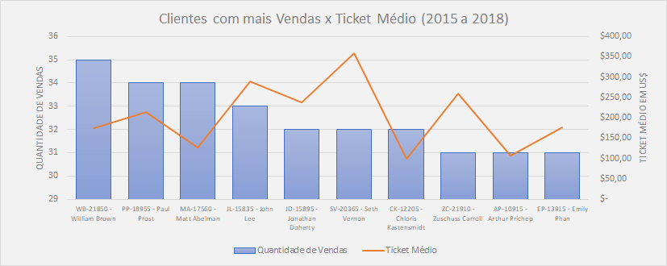
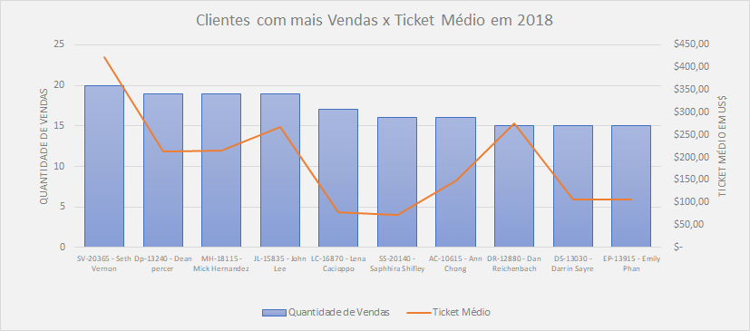
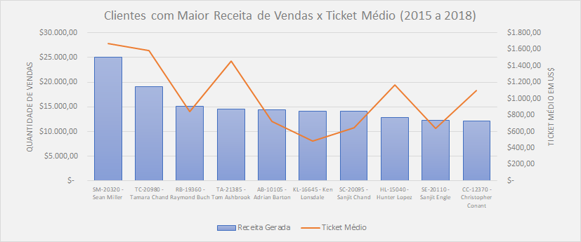
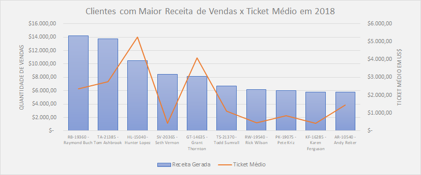
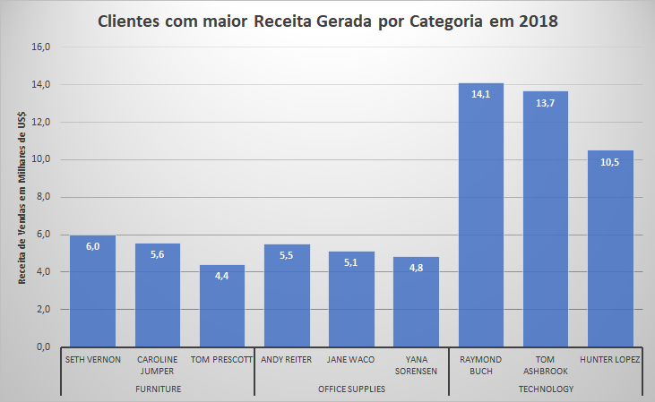
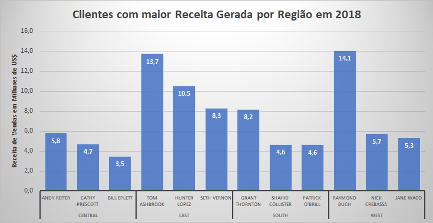

[< INÍCIO](../README.md)

# Pergunta de Negócio 5: Quem são os principais clientes em termos de valor gerado e quantidade de vendas?

Nesta seção, analisamos as variáveis **Customer_ID** e **Customer_Name**, juntamente com a variável de valor de venda, para identificar quais clientes mais geraram volume e receita de vendas para a companhia.

## Vendas por Cliente

Em primeiro lugar, observamos quem são os clientes que realizaram mais compras entre 2015 e 2018.

### Top 10 Clientes com mais Compras de 2015 a 2018

O cliente com maior quantidade de compras é **William Brown**, com **35** registros de compras a nível nacional. Em segundo lugar estão **Paul Prost** e **Matt Abelman**, com **34** compras no mesmo período. Em terceiro lugar temos **John Lee**, com **33** compras. 

*Destacamos o cliente **Seth Vernon**, que efetuou 32 compras e foi o que mais gerou receita de vendas neste Top 10.* O Top 10 dos clientes com maior número de compras representa **3,32%** do total de compras realizadas de 2015 a 2018.

### Top 10 Clientes com mais Compras em 2018

Ao analisar o último ano incluído no relatório (**2018**), encontramos que o cliente com maior quantidade de compras realizadas foi **Seth Vernon**, com **20** compras, seguido por **Dean Percer**, **Mick Hernandez** e **John Lee**, com **19** compras cada. O Top 10 dos clientes com maior número de compras representa **5,25%** do total de compras realizadas em 2018.

### Top 10 Clientes com maior receita gerada de 2015 a 2018

Em relação à receita de vendas gerada pelos clientes de 2015 a 2018, o cliente que se destaca em primeiro lugar é **Sean Miller**, com **US$ 25.043,05**. 

Considerando os **10 clientes** com maior receita de vendas no período, eles representam **6,80%** da receita total gerada pela companhia.

*Vale destacar que o **Ticket Médio** destes clientes é superior ao dos clientes com maior volume de compras apresentados anteriormente.*

### Top 10 Clientes com maior receita gerada em 2018

Ao analisar os clientes que mais receita geraram para a empresa em **2018**, o mais destacado é **Raymond Buch**, com **US$ 14.203,28**, seguido por **Tom Ashbrook** (US$ 13.723,50) e **Hunter Lopez** (US$ 10.522,55). 

Concluímos que os **10 clientes** com maior receita em 2018 representam **11,85%** da receita total da companhia no período.

## Clientes com maior Receita de Vendas Gerada por Categoria em 2018

Com o objetivo de orientar a equipe comercial de cada **Categoria de Produto**, identificamos os clientes com maior geração de receita de vendas para cada categoria. Os resultados foram os seguintes:

- **Furniture**: O cliente com maior receita de vendas é **Seth Vernon**, que gerou **2,82%** da receita total desta categoria. **Caroline Jumper** (2,62%) e **Tom Prescott** (2,08%) ocupam o segundo e terceiro lugares, respectivamente.

- **Office Supplies**: **Andy Reiter** foi o cliente com maior receita nesta categoria, com **2,30%** do total. Também se destacam **Jane Waco** (2,13%) e **Yana Sorensen** (2,01%).

- **Technology**: Nesta categoria, **Raymond Buch** foi o cliente que gerou a maior receita, com **5,24%** do total, seguido por **Tom Ashbrook** (5,07%) e **Hunter Lopez** (3,90%).

## Clientes com maior Receita de Vendas Gerada por Região em 2018

Foi analisada a receita de vendas gerada pelos clientes para cada região em 2018.

> **Nota:** Nesta análise, percebemos que alguns clientes compram em mais de uma região.

- **CENTRAL**: O cliente com maior receita gerada foi **Andy Reiter**, com **US$ 5.802,70**, representando **4,10%** da receita total da região.
- **EAST**: O cliente com maior receita gerada foi **Tom Ashbrook**, com **US$ 13.723,50**, representando **6,53%** da receita total da região.
- **SOUTH**: O cliente com maior receita gerada foi **Grant Thornton**, com **US$ 8.167,42**, representando **6,69%** da receita total da região.
- **WEST**: O cliente com maior receita gerada foi **Raymond Buch**, com **US$ 14.052,48**, representando **5,66%** da receita total da região.

## Conclusões

Com o objetivo de obter insights valiosos para a equipe comercial, analisamos as variáveis de cliente junto com seus valores de vendas e chegamos aos seguintes resultados:

### Análise de Vendas por Clientes

#### Análise por quantidade de compras
Foram analisados os clientes pela quantidade de compras realizadas. Os resultados foram os seguintes:

##### Clientes com maior quantidade de Compras Realizadas de 2015 a 2018
Os clientes com maior volume de compras no período são:
1. **William Brown** (35 compras)
2. **Paul Prost** (34 compras)
2. **Matt Abelman** (34 compras)
3. **John Lee** (33 compras)

##### Clientes com maior quantidade de Compras Realizadas em 2018
Os clientes com maior volume de compras em 2018 foram:
1. **Seth Vernon** (20 compras)
2. **Dean Percer** (19 compras)
2. **Mick Hernandez** (19 compras)
2. **John Lee** (19 compras)
3. **Lena Cacioppo** (17 compras)

#### Análise por receita de vendas gerada
Foram analisados os clientes pelo valor da receita de vendas gerada. Os resultados foram os seguintes:

##### Clientes com maior Receita de Vendas Gerada de 2015 a 2018
Os clientes com maior receita de vendas no período foram:
1. **Sean Miller** com US$ 25.043,05
2. **Tamara Chand** com US$ 19.052,22
3. **Raymond Buch** com US$ 15.117,34

##### Clientes com maior Receita de Vendas Gerada em 2018
Os clientes com maior receita de vendas em 2018 foram:
1. **Raymond Buch** com US$ 14.203,28
2. **Tom Ashbrook** com US$ 13.723,50
3. **Hunter Lopez** com US$ 10.522,55

### Análise de Vendas por Clientes por Categoria em 2018
Para orientar os responsáveis de cada categoria, listamos os clientes com maior receita de vendas em 2018:

- **Furniture**: **Seth Vernon** com US$ 5.987,04
- **Office Supplies**: **Andy Reiter** com US$ 5.517,91
- **Technology**: **Raymond Buch** com US$ 14.119,92

### Análise de Vendas por Clientes por Região em 2018
Para orientar os líderes regionais de vendas, identificamos os clientes com maior receita gerada em cada região em 2018:

- **CENTRAL**: **Andy Reiter** com US$ 5.802,70
- **EAST**: **Tom Ashbrook** com US$ 13.723,50
- **SOUTH**: **Grant Thornton** com US$ 8.167,42
- **WEST**: **Raymond Buch** com US$ 14.052,48