< INÍCIO](../README.md)

# Pergunta de Negócio 6: Existe sazonalidade nas vendas da empresa? Se sim, quais são os meses de pico em quantidade de vendas e receita?

Por meio da análise das datas dos pedidos e do valor das vendas, buscamos identificar se há períodos do ano com maior volume de vendas. Os resultados foram os seguintes:

## Quantidade Mensal de Vendas de 2015 a 2018

Ao analisar a quantidade mensal de vendas, observamos um aumento significativo no final do ano, especialmente nos meses de **Novembro (14,8%)**, **Dezembro (14,1%)** e **Setembro (13,8%)**. Por outro lado, os meses com menor volume foram **Fevereiro (3,0%)** e **Janeiro (3,7%)**. 

Entre **Março e Agosto**, o volume se manteve relativamente estável (entre 6,7% e 7,4% do total). **Outubro**, embora tenha apresentado volume superior aos meses de baixa, ficou abaixo de Setembro, Novembro e Dezembro.

O comportamento anual das vendas (por quantidade) pode ser visualizado no gráfico abaixo:

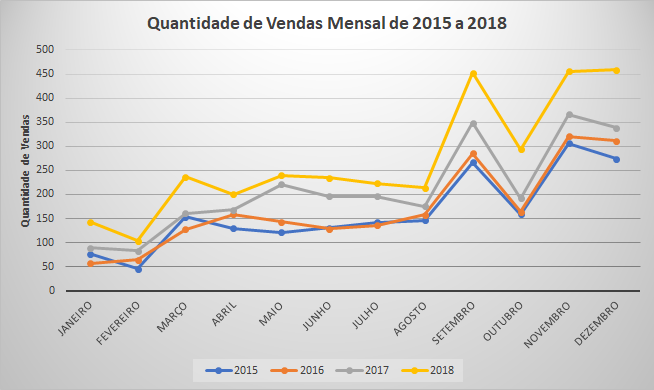

## Receita de Vendas Mensal de 2015 a 2018

Quanto à receita mensal, verificamos um padrão similar ao do volume de vendas, com picos em **Novembro (15,5%)**, **Dezembro (14,2%)** e **Setembro (13,3%)**. Os meses de menor receita foram **Fevereiro (2,6%)** e **Janeiro (4,2%)**.

Entre **Abril e Agosto**, a receita permaneceu estável (entre 6,0% e 7,0% do total). **Março (8,7%)** e **Outubro (8,8%)** apresentaram valores superiores a esse intervalo.

No gráfico abaixo, é possível observar o comportamento da receita ao longo de cada ano:

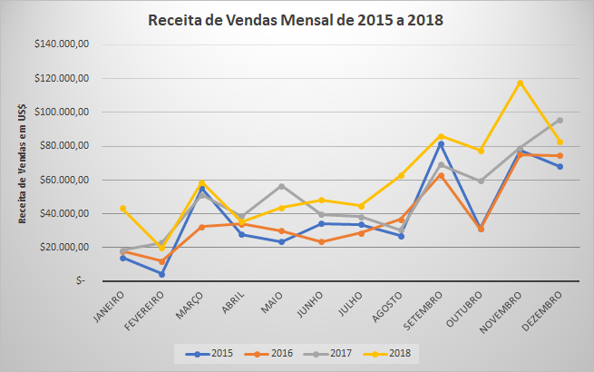

## Quantidade de Vendas Trimestral de 2015 a 2018

Analisando a sazonalidade por trimestre, identificamos que o **4º trimestre** teve o maior volume de vendas (**37,1%** do total), seguido pelo **3º trimestre (28,0%)** e **2º trimestre (21,2%)**. O **1º trimestre** registrou o menor volume (**13,7%**).

A sazonalidade trimestral também pode ser observada no gráfico:

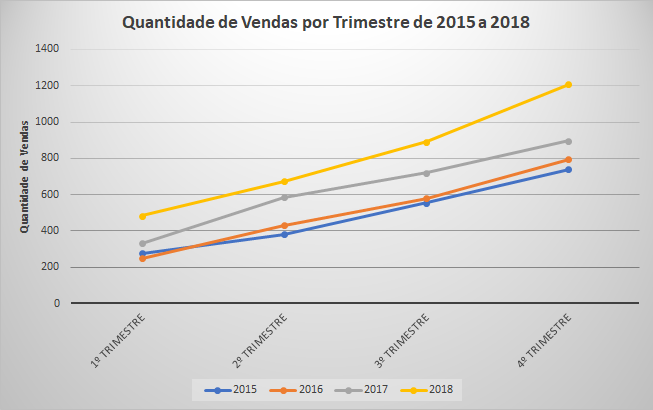

## Receita de Vendas Trimestral de 2015 a 2018

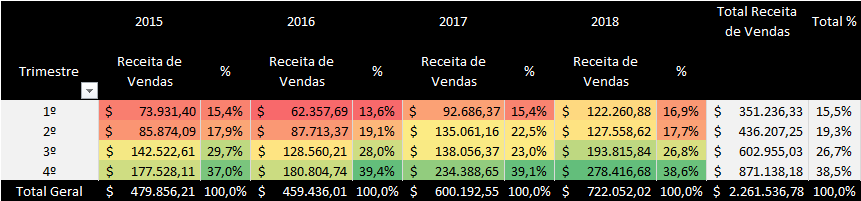

Em relação à receita por trimestre, o **4º trimestre** também se destacou, gerando **38,5%** da receita total, seguido pelo **3º trimestre (26,7%)** e **2º trimestre (19,3%)**. O **1º trimestre** registrou a menor receita (**15,5%**), corroborando o padrão observado no volume de vendas.

O comportamento da receita trimestral pode ser conferido no gráfico abaixo:

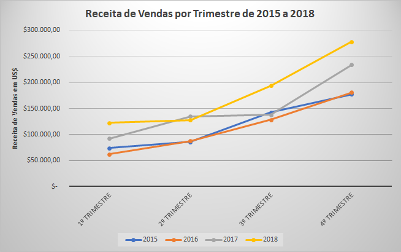

## Volume de Vendas Mensal por Categoria de 2015 a 2018

Analisamos o volume mensal de vendas para cada categoria de produto:

- **Furniture**: Os meses com maior volume foram **Dezembro (15,6%)**, **Novembro (15,2%)** e **Setembro (13,2%)**. Os menores volumes ocorreram em **Fevereiro (3,0%)** e **Janeiro (3,8%)**.
  
  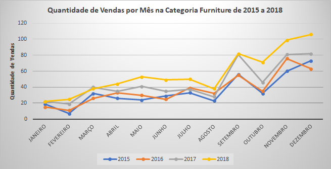

- **Office Supplies**: Os meses de pico foram **Novembro e Setembro (14,4% cada)**, seguidos por **Dezembro (13,7%)**. Os meses mais baixos foram **Fevereiro (3,0%)** e **Janeiro (3,7%)**.
  
  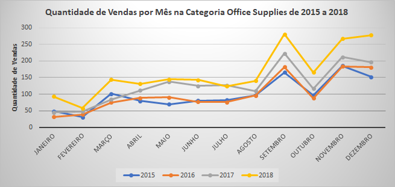

- **Technology**: O mês com maior volume foi **Novembro (15,7%)**, seguido por **Dezembro (13,8%)** e **Setembro (12,6%)**. Os menores volumes ocorreram em **Fevereiro (3,3%)** e **Janeiro (3,8%)**.
  
  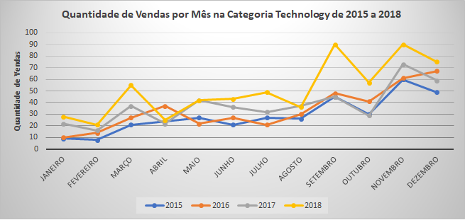

## Volume de Vendas Mensal por Região de 2015 a 2018

Para orientar as equipes comerciais regionais, analisamos a sazonalidade por região:

- **CENTRAL**: Maior volume em **Novembro (16,2%)**, seguido por **Dezembro (13,1%)** e **Setembro (12,6%)**.
  
  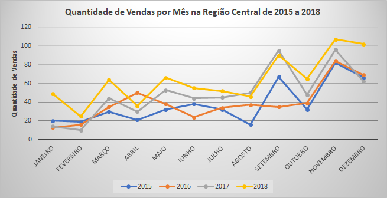

- **EAST**: Pico em **Setembro (16,0%)**, seguido por **Novembro (15,1%)** e **Dezembro (13,4%)**.
  
  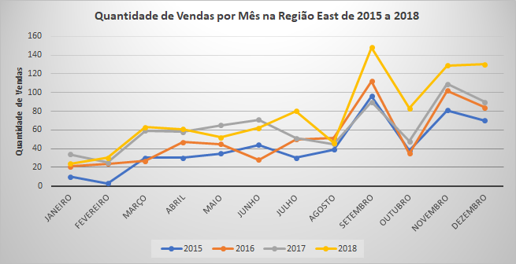

- **SOUTH**: Maior volume em **Novembro (14,0%)**, seguido por **Setembro (12,5%)** e **Dezembro (12,1%)**.
  
  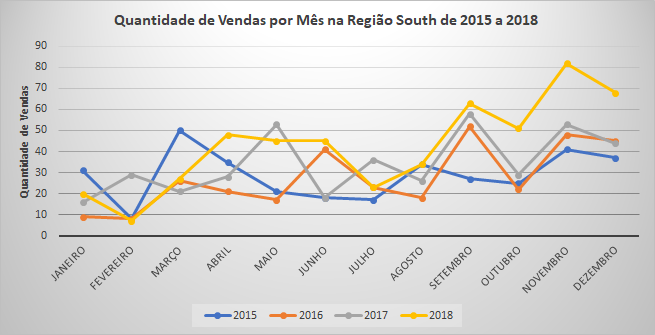

- **WEST**: Pico em **Dezembro (16,4%)**, seguido por **Novembro (13,9%)** e **Setembro (13,4%)**.
  
  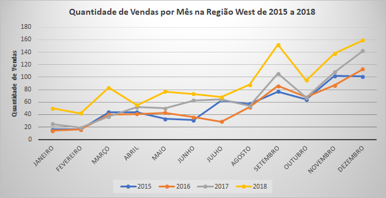

## Conclusões

Analisamos o comportamento das vendas ao longo do ano para orientar a equipe comercial em suas estratégias. Os principais resultados foram:

### Meses com Maior Volume de Vendas (2015–2018)
1. **Novembro** com 14,8% do total
2. **Dezembro** com 14,1% do total
3. **Setembro** com 13,8% do total

### Meses com Maior Receita de Vendas (2015–2018)
1. **Novembro** com 15,5% do total
2. **Dezembro** com 14,2% do total
3. **Setembro** com 13,3% do total

### Trimestre com Maior Volume de Vendas (2015–2018)
1. **4º trimestre** com 37,1% do total
2. **3º trimestre** com 28,0% do total
3. **2º trimestre** com 21,2% do total
4. **1º trimestre** com 13,7% do total

### Volume Mensal de Vendas por Categoria (2015–2018)
- **Furniture**
  - **Maiores volumes**: Dezembro (15,6%), Novembro (15,2%), Setembro (13,2%)
  - **Menores volumes**: Fevereiro (3,0%), Janeiro (3,8%)

- **Office Supplies**
  - **Maiores volumes**: Setembro e Novembro (14,4% cada), Dezembro (13,7%)
  - **Menores volumes**: Fevereiro (3,0%), Janeiro (3,7%)

- **Technology**
  - **Maiores volumes**: Novembro (15,7%), Dezembro (13,8%), Setembro (12,6%)
  - **Menores volumes**: Fevereiro (3,3%), Janeiro (3,8%)

### Volume Mensal de Vendas por Região (2015–2018)
- **CENTRAL**
  - **Maiores volumes**: Novembro (16,2%), Dezembro (13,1%), Setembro (12,6%)
  - **Menores volumes**: Fevereiro (3,1%), Janeiro (4,2%)

- **EAST**
  - **Maiores volumes**: Setembro (16,0%), Novembro (15,1%), Dezembro (13,4%)
  - **Menores volumes**: Fevereiro (2,9%), Janeiro (3,2%)

- **SOUTH**
  - **Maiores volumes**: Novembro (14,0%), Setembro (12,5%), Dezembro (12,1%)
  - **Menores volumes**: Fevereiro (3,3%), Janeiro (4,8%)

- **WEST**
  - **Maiores volumes**: Dezembro (16,4%), Novembro (13,9%), Setembro (13,4%)
  - **Menores volumes**: Fevereiro (3,0%), Janeiro (3,3%)